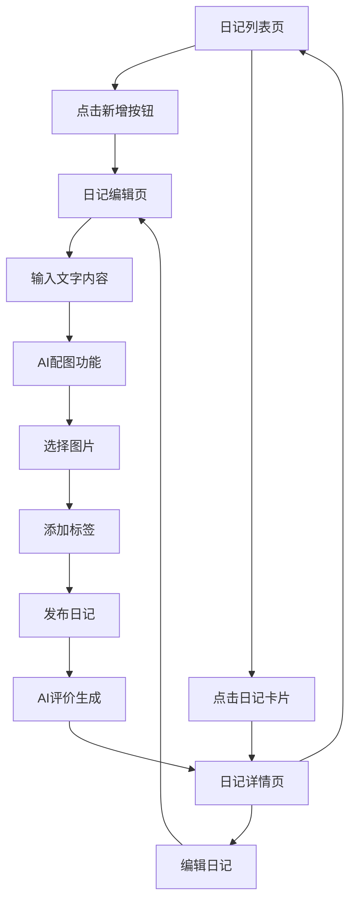

# 小六日记 - 产品需求文档

## 1. Product Overview
小六日记是一款专为小学生设计的智能日记应用，采用类似微信朋友圈的界面风格，让孩子们能够轻松记录成长的每一天。
- 通过AI配图和智能评价功能，激发孩子们的写作兴趣，培养良好的记录习惯，帮助家长了解孩子的内心世界。
- 产品旨在成为孩子们成长路上的贴心伙伴，记录珍贵的童年时光，培养表达能力和情感认知。

## 2. Core Features

### 2.1 User Roles
本产品主要面向小学生用户，无需复杂的角色区分，所有用户享有相同的功能权限。

| Role | Registration Method | Core Permissions |
|------|---------------------|------------------|
| 小学生用户 | 微信授权登录 | 可写日记、查看历史、使用AI功能、管理个人内容 |

### 2.2 Feature Module
我们的小六日记需求包含以下主要页面：
1. **日记列表页**：朋友圈风格展示、统计信息、搜索筛选功能
2. **日记编辑页**：文字输入、AI配图、心情天气选择、标签管理
3. **日记详情页**：完整内容展示、AI评价显示、互动功能
4. **个人中心页**：用户信息、设置选项、成长统计

### 2.3 Page Details

| Page Name | Module Name | Feature description |
|-----------|-------------|---------------------|
| 日记列表页 | 页面头部 | 显示"我的日记"标题和成长记录副标题，营造温馨氛围 |
| 日记列表页 | 统计卡片 | 展示总日记数、本月日记数、连续记录天数等成长数据 |
| 日记列表页 | 搜索筛选 | 支持关键词搜索、按心情筛选、按标签筛选、按时间筛选 |
| 日记列表页 | 日记卡片 | 朋友圈风格展示，包含日期标签、心情天气图标、内容预览、图片缩略图、AI评价预览 |
| 日记列表页 | 浮动按钮 | 右下角固定新增按钮，点击进入编辑页面 |
| 日记编辑页 | 日期选择 | 选择要记录的日期，默认为当天，支持补写历史日记 |
| 日记编辑页 | 心情选择 | 提供开心、难过、兴奋、平静、生气、惊喜等心情选项 |
| 日记编辑页 | 天气选择 | 提供晴天、雨天、多云、雪天等天气选项记录当天天气 |
| 日记编辑页 | 内容输入 | 多行文本输入框，支持500字限制，实时字数统计 |
| 日记编辑页 | AI配图功能 | 根据用户输入的文字内容，自动生成相关的配图建议 |
| 日记编辑页 | 图片上传 | 支持拍照或从相册选择，最多3张图片 |
| 日记编辑页 | 标签管理 | 预设标签选择和自定义标签添加功能 |
| 日记编辑页 | 发布操作 | 保存草稿和发布日记两个操作选项 |
| 日记详情页 | 内容展示 | 完整显示日记内容、图片、心情天气、标签信息 |
| 日记详情页 | AI评价 | 显示AI对日记内容的温馨评价和鼓励 |
| 日记详情页 | 操作功能 | 编辑、删除、分享等操作选项 |
| 个人中心页 | 用户信息 | 显示头像、昵称、成长天数等个人信息 |
| 个人中心页 | 成长统计 | 图表展示写作频率、心情分布、标签云等数据 |
| 个人中心页 | 设置选项 | 隐私设置、通知设置、账号管理等功能 |

## 3. Core Process

### 主要用户操作流程：

**日记记录流程：**
用户进入应用 → 查看日记列表 → 点击新增按钮 → 选择日期和心情天气 → 输入日记内容 → 触发AI配图 → 选择或上传图片 → 添加标签 → 发布日记 → 获得AI评价

**日记浏览流程：**
用户进入应用 → 浏览日记列表 → 使用搜索筛选功能 → 点击日记卡片 → 查看详细内容和AI评价 → 进行编辑或分享操作

## 4. User Interface Design

### 4.1 Design Style
- **主色调**：温暖的橙色系 (#FF6B35) 作为主色，柔和的黄色 (#F5C754) 作为辅助色
- **按钮风格**：圆角矩形按钮，采用渐变色彩和轻微阴影效果
- **字体设计**：使用系统默认字体，标题18-24px，正文14-16px，注释12px
- **布局风格**：卡片式设计，顶部导航，充足的留白空间，适合儿童操作的大按钮
- **图标风格**：采用可爱的卡通风格图标和emoji表情，增加趣味性

### 4.2 Page Design Overview

| Page Name | Module Name | UI Elements |
|-----------|-------------|-------------|
| 日记列表页 | 页面头部 | 渐变背景(#FF6B35到#F5C754)，白色大标题，居中布局 |
| 日记列表页 | 统计卡片 | 白色半透明卡片，圆角16px，数字突出显示，橙色强调 |
| 日记列表页 | 日记卡片 | 白色背景卡片，左侧日期标签，右侧内容区域，底部操作按钮 |
| 日记列表页 | 浮动按钮 | 右下角圆形按钮，橙色渐变，加号图标，阴影效果 |
| 日记编辑页 | 输入区域 | 白色卡片容器，圆角边框，内部文本框无边框，字数统计右下角 |
| 日记编辑页 | 选择组件 | 横向滚动选择器，选中项高亮显示，图标+文字组合 |
| 日记编辑页 | AI配图区域 | 虚线边框卡片，中央显示AI生成的图片建议，可点击选择 |
| 日记详情页 | 内容展示 | 全屏白色背景，内容居中对齐，图片网格布局 |
| 日记详情页 | AI评价卡片 | 淡蓝色背景卡片，AI头像+评价文字，温馨的设计风格 |

### 4.3 Responsiveness
产品采用移动端优先设计，专为微信小程序平台优化，支持不同屏幕尺寸的手机设备，界面元素采用响应式布局，确保在各种设备上都有良好的使用体验。所有交互元素都考虑了触摸操作的便利性，按钮大小适合儿童手指操作。