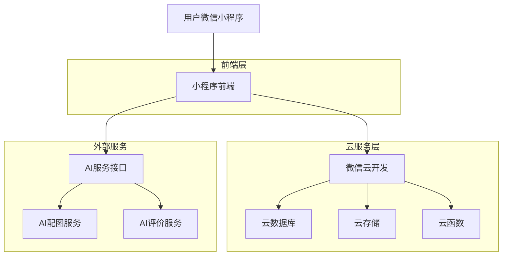
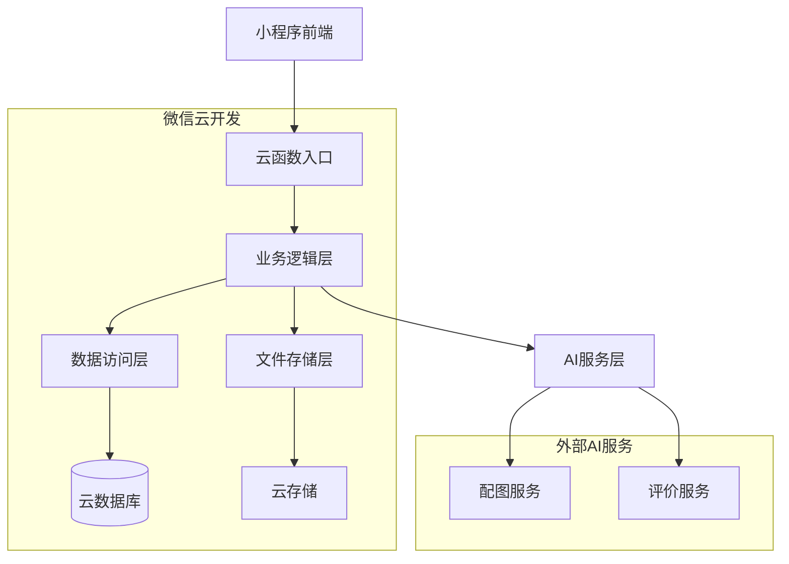
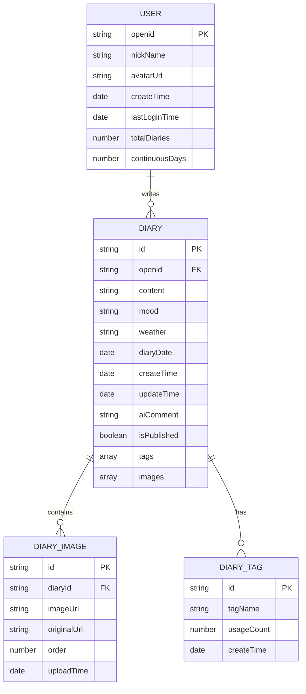

# 小六日记 - 技术架构文档

## 1. Architecture design



## 2. Technology Description

- 前端：微信小程序原生开发 + WeUI组件库
- 后端：微信云开发（云函数 + 云数据库 + 云存储）
- AI服务：百度文心一言API / 腾讯混元API
- 数据库：微信云开发 MongoDB

## 3. Route definitions

| Route | Purpose |
|-------|---------|
| /pages/diary/list | 日记列表页，展示朋友圈风格的日记列表和统计信息 |
| /pages/diary/write | 日记编辑页，支持文字输入、AI配图、心情天气选择 |
| /pages/diary/detail | 日记详情页，显示完整日记内容和AI评价 |
| /pages/profile/index | 个人中心页，用户信息和成长统计 |
| /pages/profile/settings | 设置页面，隐私和通知设置 |

## 4. API definitions

### 4.1 Core API

日记相关接口
```
POST /api/diary/create
```

Request:
| Param Name| Param Type  | isRequired  | Description |
|-----------|-------------|-------------|-------------|
| content   | string      | true        | 日记内容 |
| date      | string      | true        | 日记日期 |
| mood      | string      | false       | 心情状态 |
| weather   | string      | false       | 天气状况 |
| images    | array       | false       | 图片数组 |
| tags      | array       | false       | 标签数组 |

Response:
| Param Name| Param Type  | Description |
|-----------|-------------|-------------|
| success   | boolean     | 操作是否成功 |
| diaryId   | string      | 日记ID |
| aiComment | string      | AI生成的评价 |

AI配图接口
```
POST /api/ai/generateImage
```

Request:
| Param Name| Param Type  | isRequired  | Description |
|-----------|-------------|-------------|-------------|
| content   | string      | true        | 日记文字内容 |
| style     | string      | false       | 图片风格偏好 |

Response:
| Param Name| Param Type  | Description |
|-----------|-------------|-------------|
| success   | boolean     | 生成是否成功 |
| imageUrl  | string      | 生成的图片URL |
| suggestions | array     | 多个图片建议 |

AI评价接口
```
POST /api/ai/generateComment
```

Request:
| Param Name| Param Type  | isRequired  | Description |
|-----------|-------------|-------------|-------------|
| content   | string      | true        | 日记内容 |
| mood      | string      | false       | 用户心情 |
| age       | number      | false       | 用户年龄 |

Response:
| Param Name| Param Type  | Description |
|-----------|-------------|-------------|
| success   | boolean     | 生成是否成功 |
| comment   | string      | AI生成的温馨评价 |
| encouragement | string  | 鼓励话语 |

## 5. Server architecture diagram



## 6. Data model

### 6.1 Data model definition



### 6.2 Data Definition Language

用户表 (users)
```javascript
// 云数据库集合：users
{
  _id: "auto_generated_id",
  _openid: "user_openid", // 微信用户唯一标识
  nickName: "用户昵称",
  avatarUrl: "头像URL",
  createTime: new Date(),
  lastLoginTime: new Date(),
  totalDiaries: 0,
  continuousDays: 0,
  settings: {
    notificationEnabled: true,
    privacyLevel: "private"
  }
}

// 索引
db.collection('users').createIndex({
  "_openid": 1
}, {
  unique: true
})
```

日记表 (diaries)
```javascript
// 云数据库集合：diaries
{
  _id: "auto_generated_id",
  _openid: "user_openid",
  content: "日记内容文字",
  mood: "happy", // 心情状态
  weather: "sunny", // 天气状况
  diaryDate: "2024-01-15", // 日记日期
  createTime: new Date(),
  updateTime: new Date(),
  aiComment: "AI生成的温馨评价",
  aiImageSuggestions: ["image_url_1", "image_url_2"],
  isPublished: true,
  tags: ["学习", "开心", "成长"],
  images: [
    {
      url: "image_url",
      originalUrl: "original_url",
      order: 1
    }
  ],
  stats: {
    wordCount: 150,
    readCount: 0
  }
}

// 索引
db.collection('diaries').createIndex({
  "_openid": 1,
  "diaryDate": -1
})

db.collection('diaries').createIndex({
  "_openid": 1,
  "createTime": -1
})
```

标签表 (tags)
```javascript
// 云数据库集合：tags
{
  _id: "auto_generated_id",
  tagName: "标签名称",
  usageCount: 10, // 使用次数
  createTime: new Date(),
  category: "emotion" // 标签分类：emotion, activity, weather等
}

// 索引
db.collection('tags').createIndex({
  "tagName": 1
}, {
  unique: true
})

db.collection('tags').createIndex({
  "usageCount": -1
})
```

云函数示例 (createDiary)
```javascript
// 云函数：createDiary
const cloud = require('wx-server-sdk')
cloud.init()
const db = cloud.database()

exports.main = async (event, context) => {
  const { content, date, mood, weather, images, tags } = event
  const { OPENID } = cloud.getWXContext()
  
  try {
    // 创建日记记录
    const diaryResult = await db.collection('diaries').add({
      data: {
        _openid: OPENID,
        content,
        diaryDate: date,
        mood,
        weather,
        images: images || [],
        tags: tags || [],
        createTime: new Date(),
        updateTime: new Date(),
        isPublished: true
      }
    })
    
    // 调用AI评价服务
    const aiComment = await generateAIComment(content, mood)
    
    // 更新日记添加AI评价
    await db.collection('diaries').doc(diaryResult._id).update({
      data: {
        aiComment,
        updateTime: new Date()
      }
    })
    
    return {
      success: true,
      diaryId: diaryResult._id,
      aiComment
    }
  } catch (error) {
    return {
      success: false,
      error: error.message
    }
  }
}
```