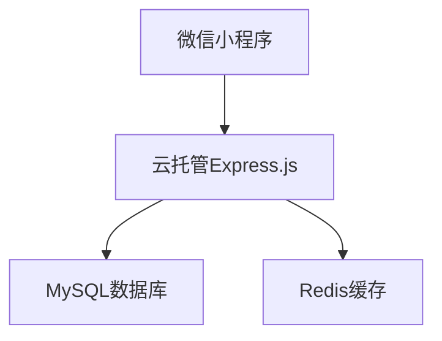
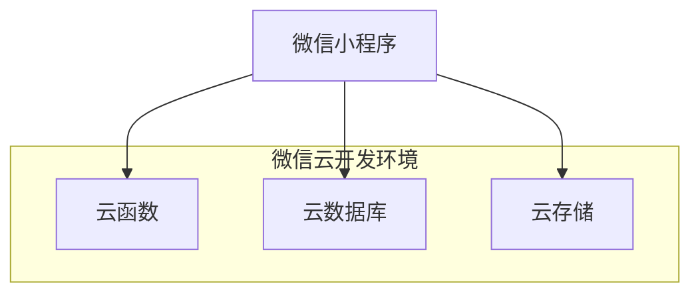

# 成长日记小程序微信云开发配置方案

## 1. 项目概述

### 1.1 技术架构转换
将现有的云托管架构转换为微信云开发架构，使用云数据库、云函数和云存储替代Express.js后端服务。

### 1.2 架构对比
**原架构（云托管）:**


**新架构（云开发）:**


## 2. 云数据库集合设计

### 2.1 用户集合 (users)
```javascript
// 集合名称: users
{
  _id: "自动生成的文档ID",
  _openid: "用户openid（自动获取）",
  nickname: "用户昵称",
  avatarUrl: "头像URL",
  points: 0, // 用户积分
  totalDiaries: 0, // 总日记数
  continuousDays: 0, // 连续记录天数
  lastDiaryDate: null, // 最后记录日期
  createTime: "创建时间（自动生成）",
  updateTime: "更新时间（自动生成）"
}
```

### 2.2 日记集合 (diaries)
```javascript
// 集合名称: diaries
{
  _id: "自动生成的文档ID",
  _openid: "用户openid（自动获取）",
  diaryDate: "2024-01-01", // 日记日期
  content: "日记内容",
  mood: "开心", // 心情
  weather: "晴天", // 天气
  images: [], // 图片列表
  tags: [], // 标签列表
  aiComment: "", // AI评价
  isDraft: false, // 是否草稿
  createTime: "创建时间（自动生成）",
  updateTime: "更新时间（自动生成）"
}
```

### 2.3 任务集合 (tasks)
```javascript
// 集合名称: tasks
{
  _id: "自动生成的文档ID",
  _openid: "用户openid（自动获取）",
  title: "任务标题",
  description: "任务描述",
  category: "daily", // 任务分类
  pointsReward: 10, // 完成奖励积分
  isSystem: false, // 是否系统任务
  isCompleted: false, // 是否完成
  completedAt: null, // 完成时间
  taskDate: "2024-01-01", // 任务日期
  createTime: "创建时间（自动生成）",
  updateTime: "更新时间（自动生成）"
}
```

### 2.4 积分记录集合 (pointRecords)
```javascript
// 集合名称: pointRecords
{
  _id: "自动生成的文档ID",
  _openid: "用户openid（自动获取）",
  amount: 10, // 积分变动数量(正数为增加，负数为扣除)
  source: "完成任务", // 积分来源
  description: "完成任务获得10积分", // 详细描述
  relatedId: "任务ID或其他关联ID", // 关联记录ID
  relatedType: "task", // 关联类型(task/lottery/diary等)
  createTime: "创建时间（自动生成）"
}
```

### 2.5 抽奖奖品集合 (lotteryPrizes)
```javascript
// 集合名称: lotteryPrizes
{
  _id: "自动生成的文档ID",
  name: "小红花", // 奖品名称
  description: "表扬奖励", // 奖品描述
  imageUrl: "", // 奖品图片
  probability: 0.3, // 中奖概率(0-1)
  stock: -1, // 库存数量(-1表示无限)
  isActive: true, // 是否启用
  createTime: "创建时间（自动生成）",
  updateTime: "更新时间（自动生成）"
}
```

### 2.6 抽奖记录集合 (lotteryRecords)
```javascript
// 集合名称: lotteryRecords
{
  _id: "自动生成的文档ID",
  _openid: "用户openid（自动获取）",
  prizeId: "中奖奖品ID", // null表示未中奖
  costPoints: 10, // 消耗积分
  isWinner: false, // 是否中奖
  createTime: "创建时间（自动生成）"
}
```

## 3. 云函数设计

### 3.1 用户认证相关云函数

#### login 云函数
```javascript
// cloudfunctions/login/index.js
const cloud = require('wx-server-sdk')
cloud.init({ env: cloud.DYNAMIC_CURRENT_ENV })
const db = cloud.database()

exports.main = async (event, context) => {
  const { OPENID } = cloud.getWXContext()
  
  try {
    // 查找或创建用户
    const userResult = await db.collection('users').where({
      _openid: OPENID
    }).get()
    
    let userInfo
    if (userResult.data.length === 0) {
      // 新用户，创建记录
      const createResult = await db.collection('users').add({
        data: {
          _openid: OPENID,
          nickname: event.nickname || '新用户',
          avatarUrl: event.avatarUrl || '',
          points: 0,
          totalDiaries: 0,
          continuousDays: 0,
          lastDiaryDate: null
        }
      })
      
      userInfo = {
        _id: createResult._id,
        _openid: OPENID,
        nickname: event.nickname || '新用户',
        avatarUrl: event.avatarUrl || '',
        points: 0,
        totalDiaries: 0,
        continuousDays: 0,
        lastDiaryDate: null
      }
    } else {
      userInfo = userResult.data[0]
    }
    
    return {
      success: true,
      data: {
        userInfo: userInfo
      }
    }
  } catch (error) {
    return {
      success: false,
      error: error.message
    }
  }
}
```

#### updateProfile 云函数
```javascript
// cloudfunctions/updateProfile/index.js
const cloud = require('wx-server-sdk')
cloud.init({ env: cloud.DYNAMIC_CURRENT_ENV })
const db = cloud.database()

exports.main = async (event, context) => {
  const { OPENID } = cloud.getWXContext()
  
  try {
    const { nickname, avatarUrl } = event
    
    const result = await db.collection('users').where({
      _openid: OPENID
    }).update({
      data: {
        nickname: nickname,
        avatarUrl: avatarUrl,
        updateTime: new Date()
      }
    })
    
    return {
      success: true,
      data: result
    }
  } catch (error) {
    return {
      success: false,
      error: error.message
    }
  }
}
```

### 3.2 积分管理相关云函数

#### addPoints 云函数
```javascript
// cloudfunctions/addPoints/index.js
const cloud = require('wx-server-sdk')
cloud.init({ env: cloud.DYNAMIC_CURRENT_ENV })
const db = cloud.database()
const _ = db.command

exports.main = async (event, context) => {
  const { OPENID } = cloud.getWXContext()
  
  try {
    const { amount, source, description, relatedId, relatedType } = event
    
    // 开始事务
    const transaction = await db.startTransaction()
    
    try {
      // 更新用户积分
      await transaction.collection('users').where({
        _openid: OPENID
      }).update({
        data: {
          points: _.inc(amount),
          updateTime: new Date()
        }
      })
      
      // 添加积分记录
      await transaction.collection('pointRecords').add({
        data: {
          _openid: OPENID,
          amount: amount,
          source: source,
          description: description,
          relatedId: relatedId || null,
          relatedType: relatedType || null
        }
      })
      
      // 提交事务
      await transaction.commit()
      
      // 获取更新后的用户信息
      const userResult = await db.collection('users').where({
        _openid: OPENID
      }).get()
      
      return {
        success: true,
        data: {
          newBalance: userResult.data[0].points
        }
      }
    } catch (error) {
      await transaction.rollback()
      throw error
    }
  } catch (error) {
    return {
      success: false,
      error: error.message
    }
  }
}
```

#### deductPoints 云函数
```javascript
// cloudfunctions/deductPoints/index.js
const cloud = require('wx-server-sdk')
cloud.init({ env: cloud.DYNAMIC_CURRENT_ENV })
const db = cloud.database()
const _ = db.command

exports.main = async (event, context) => {
  const { OPENID } = cloud.getWXContext()
  
  try {
    const { amount, source, description, relatedId, relatedType } = event
    
    // 检查用户积分是否足够
    const userResult = await db.collection('users').where({
      _openid: OPENID
    }).get()
    
    if (userResult.data.length === 0) {
      throw new Error('用户不存在')
    }
    
    const currentPoints = userResult.data[0].points
    if (currentPoints < amount) {
      throw new Error('积分不足')
    }
    
    // 开始事务
    const transaction = await db.startTransaction()
    
    try {
      // 扣除用户积分
      await transaction.collection('users').where({
        _openid: OPENID
      }).update({
        data: {
          points: _.inc(-amount),
          updateTime: new Date()
        }
      })
      
      // 添加积分记录
      await transaction.collection('pointRecords').add({
        data: {
          _openid: OPENID,
          amount: -amount,
          source: source,
          description: description,
          relatedId: relatedId || null,
          relatedType: relatedType || null
        }
      })
      
      // 提交事务
      await transaction.commit()
      
      return {
        success: true,
        data: {
          newBalance: currentPoints - amount
        }
      }
    } catch (error) {
      await transaction.rollback()
      throw error
    }
  } catch (error) {
    return {
      success: false,
      error: error.message
    }
  }
}
```

### 3.3 日记管理相关云函数

#### saveDiary 云函数
```javascript
// cloudfunctions/saveDiary/index.js
const cloud = require('wx-server-sdk')
cloud.init({ env: cloud.DYNAMIC_CURRENT_ENV })
const db = cloud.database()
const _ = db.command

exports.main = async (event, context) => {
  const { OPENID } = cloud.getWXContext()
  
  try {
    const { diaryDate, content, mood, weather, images, tags, isDraft } = event
    
    // 检查是否已存在该日期的日记
    const existingDiary = await db.collection('diaries').where({
      _openid: OPENID,
      diaryDate: diaryDate
    }).get()
    
    let result
    if (existingDiary.data.length > 0) {
      // 更新现有日记
      result = await db.collection('diaries').doc(existingDiary.data[0]._id).update({
        data: {
          content: content,
          mood: mood,
          weather: weather,
          images: images || [],
          tags: tags || [],
          isDraft: isDraft || false,
          updateTime: new Date()
        }
      })
    } else {
      // 创建新日记
      result = await db.collection('diaries').add({
        data: {
          _openid: OPENID,
          diaryDate: diaryDate,
          content: content,
          mood: mood,
          weather: weather,
          images: images || [],
          tags: tags || [],
          isDraft: isDraft || false
        }
      })
      
      // 如果不是草稿，更新用户统计信息
      if (!isDraft) {
        await db.collection('users').where({
          _openid: OPENID
        }).update({
          data: {
            totalDiaries: _.inc(1),
            lastDiaryDate: diaryDate,
            updateTime: new Date()
          }
        })
      }
    }
    
    return {
      success: true,
      data: result
    }
  } catch (error) {
    return {
      success: false,
      error: error.message
    }
  }
}
```

#### getDiaries 云函数
```javascript
// cloudfunctions/getDiaries/index.js
const cloud = require('wx-server-sdk')
cloud.init({ env: cloud.DYNAMIC_CURRENT_ENV })
const db = cloud.database()

exports.main = async (event, context) => {
  const { OPENID } = cloud.getWXContext()
  
  try {
    const { page = 1, pageSize = 10, startDate, endDate } = event
    
    let query = db.collection('diaries').where({
      _openid: OPENID,
      isDraft: false
    })
    
    // 日期范围筛选
    if (startDate && endDate) {
      query = query.where({
        diaryDate: db.command.gte(startDate).and(db.command.lte(endDate))
      })
    }
    
    const result = await query
      .orderBy('diaryDate', 'desc')
      .skip((page - 1) * pageSize)
      .limit(pageSize)
      .get()
    
    return {
      success: true,
      data: result.data
    }
  } catch (error) {
    return {
      success: false,
      error: error.message
    }
  }
}
```

### 3.4 任务管理相关云函数

#### getTasks 云函数
```javascript
// cloudfunctions/getTasks/index.js
const cloud = require('wx-server-sdk')
cloud.init({ env: cloud.DYNAMIC_CURRENT_ENV })
const db = cloud.database()

exports.main = async (event, context) => {
  const { OPENID } = cloud.getWXContext()
  
  try {
    const { taskDate } = event
    
    const result = await db.collection('tasks').where({
      _openid: OPENID,
      taskDate: taskDate
    }).get()
    
    return {
      success: true,
      data: result.data
    }
  } catch (error) {
    return {
      success: false,
      error: error.message
    }
  }
}
```

#### completeTask 云函数
```javascript
// cloudfunctions/completeTask/index.js
const cloud = require('wx-server-sdk')
cloud.init({ env: cloud.DYNAMIC_CURRENT_ENV })
const db = cloud.database()
const _ = db.command

exports.main = async (event, context) => {
  const { OPENID } = cloud.getWXContext()
  
  try {
    const { taskId } = event
    
    // 获取任务信息
    const taskResult = await db.collection('tasks').doc(taskId).get()
    if (taskResult.data.length === 0) {
      throw new Error('任务不存在')
    }
    
    const task = taskResult.data
    if (task.isCompleted) {
      throw new Error('任务已完成')
    }
    
    // 开始事务
    const transaction = await db.startTransaction()
    
    try {
      // 标记任务完成
      await transaction.collection('tasks').doc(taskId).update({
        data: {
          isCompleted: true,
          completedAt: new Date(),
          updateTime: new Date()
        }
      })
      
      // 增加用户积分
      await transaction.collection('users').where({
        _openid: OPENID
      }).update({
        data: {
          points: _.inc(task.pointsReward),
          updateTime: new Date()
        }
      })
      
      // 添加积分记录
      await transaction.collection('pointRecords').add({
        data: {
          _openid: OPENID,
          amount: task.pointsReward,
          source: '完成任务',
          description: `完成任务"${task.title}"获得${task.pointsReward}积分`,
          relatedId: taskId,
          relatedType: 'task'
        }
      })
      
      // 提交事务
      await transaction.commit()
      
      return {
        success: true,
        data: {
          pointsEarned: task.pointsReward
        }
      }
    } catch (error) {
      await transaction.rollback()
      throw error
    }
  } catch (error) {
    return {
      success: false,
      error: error.message
    }
  }
}
```

### 3.5 抽奖相关云函数

#### lottery 云函数
```javascript
// cloudfunctions/lottery/index.js
const cloud = require('wx-server-sdk')
cloud.init({ env: cloud.DYNAMIC_CURRENT_ENV })
const db = cloud.database()
const _ = db.command

exports.main = async (event, context) => {
  const { OPENID } = cloud.getWXContext()
  
  try {
    const { costPoints = 10 } = event
    
    // 检查用户积分
    const userResult = await db.collection('users').where({
      _openid: OPENID
    }).get()
    
    if (userResult.data.length === 0) {
      throw new Error('用户不存在')
    }
    
    const user = userResult.data[0]
    if (user.points < costPoints) {
      throw new Error('积分不足')
    }
    
    // 获取所有可用奖品
    const prizesResult = await db.collection('lotteryPrizes').where({
      isActive: true
    }).get()
    
    if (prizesResult.data.length === 0) {
      throw new Error('暂无可用奖品')
    }
    
    // 抽奖逻辑
    const prizes = prizesResult.data
    const random = Math.random()
    let cumulativeProbability = 0
    let wonPrize = null
    
    for (const prize of prizes) {
      cumulativeProbability += prize.probability
      if (random <= cumulativeProbability) {
        wonPrize = prize
        break
      }
    }
    
    const isWinner = wonPrize !== null
    
    // 开始事务
    const transaction = await db.startTransaction()
    
    try {
      // 扣除积分
      await transaction.collection('users').where({
        _openid: OPENID
      }).update({
        data: {
          points: _.inc(-costPoints),
          updateTime: new Date()
        }
      })
      
      // 添加抽奖记录
      await transaction.collection('lotteryRecords').add({
        data: {
          _openid: OPENID,
          prizeId: wonPrize ? wonPrize._id : null,
          costPoints: costPoints,
          isWinner: isWinner
        }
      })
      
      // 添加积分记录
      await transaction.collection('pointRecords').add({
        data: {
          _openid: OPENID,
          amount: -costPoints,
          source: '抽奖消费',
          description: `抽奖消费${costPoints}积分`,
          relatedType: 'lottery'
        }
      })
      
      // 提交事务
      await transaction.commit()
      
      return {
        success: true,
        data: {
          isWinner: isWinner,
          prize: wonPrize,
          newBalance: user.points - costPoints
        }
      }
    } catch (error) {
      await transaction.rollback()
      throw error
    }
  } catch (error) {
    return {
      success: false,
      error: error.message
    }
  }
}
```

### 3.6 AI相关云函数

#### generateAIComment 云函数
```javascript
// cloudfunctions/generateAIComment/index.js
const cloud = require('wx-server-sdk')
cloud.init({ env: cloud.DYNAMIC_CURRENT_ENV })

exports.main = async (event, context) => {
  try {
    const { content, mood, weather } = event
    
    // 这里集成扣子AI API
    // 需要在云函数中配置API密钥
    const response = await callCozeAPI({
      input: content,
      tianqi: weather,
      xinqin: mood
    })
    
    return {
      success: true,
      data: {
        aiComment: response.aiComment
      }
    }
  } catch (error) {
    return {
      success: false,
      error: error.message
    }
  }
}

// 调用扣子AI API的辅助函数
async function callCozeAPI(params) {
  // 实现扣子AI API调用逻辑
  // 返回AI生成的评论
  return {
    aiComment: "这是AI生成的评论内容"
  }
}
```

## 4. 数据库权限配置

### 4.1 集合权限设置

在微信开发者工具的云开发控制台中，为每个集合设置以下权限：

#### users 集合权限
```json
{
  "read": "doc._openid == auth.openid",
  "write": "doc._openid == auth.openid"
}
```

#### diaries 集合权限
```json
{
  "read": "doc._openid == auth.openid",
  "write": "doc._openid == auth.openid"
}
```

#### tasks 集合权限
```json
{
  "read": "doc._openid == auth.openid",
  "write": "doc._openid == auth.openid"
}
```

#### pointRecords 集合权限
```json
{
  "read": "doc._openid == auth.openid",
  "write": false
}
```

#### lotteryPrizes 集合权限
```json
{
  "read": true,
  "write": false
}
```

#### lotteryRecords 集合权限
```json
{
  "read": "doc._openid == auth.openid",
  "write": false
}
```

### 4.2 数据库索引配置

为提高查询性能，需要创建以下索引：

#### users 集合索引
- `_openid` (升序)
- `points` (降序)

#### diaries 集合索引
- `_openid` + `diaryDate` (复合索引)
- `diaryDate` (降序)

#### tasks 集合索引
- `_openid` + `taskDate` (复合索引)
- `isCompleted` (升序)

#### pointRecords 集合索引
- `_openid` + `createTime` (复合索引)
- `source` (升序)

#### lotteryRecords 集合索引
- `_openid` + `createTime` (复合索引)
- `isWinner` (升序)

## 5. 云存储配置

### 5.1 存储桶设置
- 创建存储桶用于存储用户上传的图片
- 设置合适的访问权限和安全规则

### 5.2 图片上传处理
```javascript
// 在小程序中上传图片到云存储
wx.cloud.uploadFile({
  cloudPath: `diary-images/${Date.now()}-${Math.random()}.jpg`,
  filePath: tempFilePath,
  success: res => {
    console.log('上传成功', res.fileID)
  }
})
```

## 6. 小程序端代码修改

### 6.1 初始化云开发
```javascript
// app.js
App({
  onLaunch: function () {
    // 初始化云开发
    wx.cloud.init({
      env: 'your-env-id', // 替换为你的环境ID
      traceUser: true
    })
  }
})
```

### 6.2 替换API调用
将原有的 `callCloudAPI` 调用替换为云函数调用：

```javascript
// 原代码
getApp().callCloudAPI('/api/points/add', {
  amount: points,
  source: '完成任务',
  description: `完成任务获得${points}积分`
})

// 新代码
wx.cloud.callFunction({
  name: 'addPoints',
  data: {
    amount: points,
    source: '完成任务',
    description: `完成任务获得${points}积分`
  }
})
```

## 7. 配置步骤

### 7.1 开通云开发
1. 在微信开发者工具中打开项目
2. 点击"云开发"按钮
3. 开通云开发服务，选择合适的套餐

### 7.2 创建云函数
1. 在项目根目录创建 `cloudfunctions` 文件夹
2. 为每个云函数创建对应的文件夹和代码文件
3. 在云开发控制台中部署云函数

### 7.3 创建数据库集合
1. 在云开发控制台的数据库页面
2. 创建上述6个集合
3. 设置相应的权限规则

### 7.4 配置索引
1. 在每个集合的索引页面
2. 根据上述索引配置创建相应索引

### 7.5 初始化数据
```javascript
// 在云开发控制台或通过云函数初始化抽奖奖品数据
db.collection('lotteryPrizes').add({
  data: [
    {
      name: '小红花',
      description: '表扬奖励',
      probability: 0.3,
      stock: -1,
      isActive: true
    },
    {
      name: '小星星',
      description: '鼓励奖励',
      probability: 0.25,
      stock: -1,
      isActive: true
    },
    {
      name: '彩虹贴纸',
      description: '漂亮贴纸',
      probability: 0.2,
      stock: -1,
      isActive: true
    },
    {
      name: '小徽章',
      description: '成就徽章',
      probability: 0.15,
      stock: -1,
      isActive: true
    },
    {
      name: '神秘礼物',
      description: '特殊奖励',
      probability: 0.1,
      stock: -1,
      isActive: true
    }
  ]
})
```

## 8. 测试验证

### 8.1 功能测试清单
- [ ] 用户登录注册
- [ ] 日记创建和查看
- [ ] 任务完成和积分获取
- [ ] 抽奖功能
- [ ] 积分记录查看
- [ ] AI评论生成

### 8.2 性能优化
- 合理使用数据库索引
- 控制单次查询数据量
- 使用云函数缓存常用数据
- 优化图片存储和访问

## 9. 注意事项

1. **环境ID配置**: 确保小程序中的环境ID与云开发环境一致
2. **权限控制**: 严格设置数据库权限，防止数据泄露
3. **错误处理**: 在云函数中添加完善的错误处理逻辑
4. **数据备份**: 定期备份重要数据
5. **成本控制**: 监控云开发资源使用情况，避免超出配额

通过以上配置，您的成长日记小程序将完全基于微信云开发运行，实现数据的持久化存储和跨设备同步。