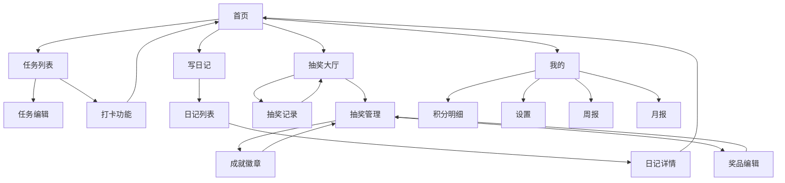

# 成长日记 - 产品需求文档

## 1. 产品概述

成长日记是一款专为小学生设计的习惯养成和成长记录微信小程序，通过任务打卡、积分奖励、日记记录等功能，可以帮助孩子培养良好习惯并记录成长足迹。

* 解决问题：帮助小学生建立良好的学习和生活习惯，提供成长记录和激励机制

* 目标用户：6-12岁小学生

* 产品价值：通过游戏化的方式培养孩子的自律性和成就感，让孩子在快乐中成长

## 2. 核心功能

### 2.1 用户角色

| 角色    | 注册方式   | 核心权限                               |
| ----- | ------ | ---------------------------------- |
| 小学生用户 | 微信授权登录 | 完成任务打卡、写日记、抽奖、管理奖品、查看个人成长报告、管理个人设置 |

### 2.2 功能模块

我们的成长日记小程序包含以下主要页面：

1. **首页**：用户信息展示、积分显示、今日任务进度环状图、快速打卡区域、心情记录入口、AI激励语录
2. **任务列表页**：自定义任务管理、任务状态显示、打卡操作、任务编辑入口
3. **任务编辑页**：任务创建和编辑表单、图标选择器、积分设置
4. **抽奖大厅**：可抽奖项目展示、抽奖转盘动画、积分余额显示
5. **抽奖记录页**：历史抽奖记录、中奖状态、奖品展示
6. **抽奖管理页**：奖品列表管理、奖品配置、成就徽章管理
7. **奖品编辑页**：奖品创建和编辑、图标上传、概率设置
8. **成就徽章页**：徽章展示、收集进度、解锁条件
9. **写日记页**：文本编辑器、心情选择器、图片上传、标签添加
10. **日记列表页**：时间轴布局、日记摘要展示、筛选功能
11. **日记详情页**：完整日记内容、AI评论展示、图片画廊
12. **周报页面**：个人周期成长数据分析、任务完成统计、心情变化趋势
13. **月报页面**：个人月度成长报告、进步对比分析、成就展示
14. **积分明细页**：积分流水记录、收支明细、积分来源统计
15. **设置页面**：个人信息管理、通知设置、基础设置

### 2.3 页面详情

| 页面名称  | 模块名称   | 功能描述                      |
| ----- | ------ | ------------------------- |
| 首页    | 用户信息区  | 显示用户头像、昵称、当前积分，支持点击查看详情   |
| 首页    | 任务进度环  | 环状图展示今日任务完成进度，动画效果显示百分比   |
| 首页    | 快速打卡区  | 显示今日未完成任务列表，一键打卡功能，打卡成功动画 |
| 首页    | 心情记录   | 快速选择今日心情，表情图标选择器，保存到日记系统  |
| 首页    | AI激励语录 | 每日更新的个性化激励语句，基于用户行为数据生成   |
| 首页    | 快捷操作   | 写日记、抽奖、查看报告的快速入口按钮        |
| 任务列表页 | 任务卡片   | 显示任务名称、图标、积分值、完成状态，支持滑动操作 |
| 任务列表页 | 打卡功能   | 点击打卡按钮，支持上传图片，积分获得提示动画    |
| 任务列表页 | 任务管理   | 添加、编辑、删除自己的任务，拖拽排序功能      |
| 任务编辑页 | 表单组件   | 任务名称、描述、积分值输入，表单验证提示      |
| 任务编辑页 | 图标选择器  | 预设图标库选择，丰富的儿童友好图标         |
| 任务编辑页 | 频率设置   | 每日、每周、自定义频率选择器            |
| 抽奖大厅  | 奖品展示   | 网格布局显示奖品，显示所需积分和可获得性      |
| 抽奖大厅  | 抽奖动画   | 转盘或卡片翻转动画，中奖结果展示          |
| 抽奖大厅  | 积分检查   | 实时显示可用积分，积分不足提示           |
| 抽奖大厅  | 管理入口   | 奖品管理按钮，进入抽奖管理页面           |
| 抽奖记录页 | 记录列表   | 时间倒序显示抽奖历史，中奖状态标识         |
| 抽奖记录页 | 奖品展示   | 显示获得的虚拟奖品和成就徽章            |
| 抽奖管理页 | 奖品列表   | 显示所有奖品，支持增删改查，状态管理        |
| 抽奖管理页 | 奖品分类   | 虚拟奖品、成就徽章、实物奖品分类管理        |
| 抽奖管理页 | 快速操作   | 批量启用/禁用，奖品排序，添加新奖品        |
| 抽奖管理页 | 统计信息   | 奖品中奖次数统计，热门奖品排行           |
| 奖品编辑页 | 基础信息   | 奖品名称、描述、类型选择，表单验证         |
| 奖品编辑页 | 图片上传   | 奖品图标/图片上传，支持裁剪和预览         |
| 奖品编辑页 | 参数设置   | 所需积分、中奖概率、库存数量设置          |
| 奖品编辑页 | 高级设置   | 奖品状态、有效期、获得条件配置           |
| 成就徽章页 | 徽章展示   | 网格布局显示所有徽章，已获得和未获得状态      |
| 成就徽章页 | 收集进度   | 徽章收集进度条，完成度统计             |
| 成就徽章页 | 徽章详情   | 徽章描述、解锁条件、获得时间展示          |
| 成就徽章页 | 徽章管理   | 自定义徽章创建，解锁条件设置            |
| 写日记页  | 文本编辑器  | 简单易用的文本编辑，字数统计，自动保存草稿     |
| 写日记页  | 心情选择器  | 表情图标选择，支持自定义心情描述          |
| 写日记页  | 图片上传   | 多图上传，图片压缩预览，拖拽排序          |
| 写日记页  | 标签系统   | 预设标签选择，自定义标签添加，标签管理       |
| 写日记页  | AI评论开关 | 选择是否生成AI评论，个人隐私设置         |
| 日记列表页 | 时间轴布局  | 按日期倒序显示，日期分组，无限滚动加载       |
| 日记列表页 | 日记卡片   | 显示日期、心情图标、内容摘要、图片缩略图      |
| 日记列表页 | 筛选功能   | 按时间范围、心情、标签筛选日记           |
| 日记详情页 | 内容展示   | 完整日记内容显示，图片画廊浏览           |
| 日记详情页 | AI评论区  | 显示AI生成的鼓励性评论和成长建议         |
| 日记详情页 | 互动功能   | 收藏、编辑功能，个人日记管理            |
| 周报页面  | 数据统计   | 个人任务完成率统计图表，积分变化趋势        |
| 周报页面  | 成长分析   | AI生成的个人周度成长分析报告           |
| 周报页面  | 亮点时刻   | 本周表现突出的任务和日记片段            |
| 月报页面  | 综合报告   | 个人月度成长综合评估，进步对比分析         |
| 月报页面  | 成就展示   | 本月获得的成就徽章，里程碑记录           |
| 月报页面  | 成长建议   | AI生成的个人成长建议和目标规划          |
| 积分明细页 | 流水记录   | 积分收支明细，来源和用途标识            |
| 积分明细页 | 统计图表   | 积分变化趋势图，收支分类统计            |
| 设置页面  | 个人信息   | 头像、昵称编辑，个人资料管理            |
| 设置页面  | 通知设置   | 任务提醒、日记提醒、报告推送设置          |
| 设置页面  | 基础设置   | AI功能开关，数据备份，账号安全设置        |

## 3. 核心流程

### 小学生用户主要操作流程：

**日常使用流程：**
用户打开小程序 → 查看首页今日任务 → 完成任务打卡 → 获得积分奖励 → 写今日日记 → 查看AI评论 → 使用积分抽奖

**任务管理流程：**
进入任务列表 → 添加新任务 → 设置任务参数 → 保存任务 → 日常打卡执行 → 查看完成统计

**成长记录流程：**
写日记 → 选择心情和标签 → 上传相关图片 → 保存日记 → AI生成评论 → 查看周/月报告

**抽奖管理流程：**
进入抽奖管理 → 查看奖品列表 → 添加新奖品 → 设置奖品参数 → 配置中奖概率 → 启用奖品 → 用户抽奖体验

**奖品配置流程：**
创建奖品 → 选择奖品类型 → 上传奖品图片 → 设置积分消耗 → 配置中奖概率 → 设置库存数量 → 保存并启用

**成就徽章管理流程：**
设计徽章 → 设置解锁条件 → 配置徽章属性 → 用户达成条件 → 自动解锁徽章 → 徽章展示

**个人成长查看流程：**
查看积分明细 → 浏览成长报告 → 回顾历史日记 → 查看获得徽章 → 设定新目标

## 4. 用户界面设计

### 4.1 设计风格

* **主色调**：温暖橙色 (#FF6B35) 和清新蓝色 (#4ECDC4)

* **辅助色**：柔和粉色 (#FFE66D)、薄荷绿 (#95E1D3)、浅灰色 (#F8F9FA)

* **按钮风格**：圆角矩形按钮，3D阴影效果，点击有弹性动画

* **字体**：微信默认字体，标题 32rpx，正文 28rpx，辅助文字 24rpx

* **布局风格**：卡片式设计，圆角 16rpx，阴影效果，间距 24rpx

* **图标风格**：线性图标配合填充图标，色彩丰富，适合儿童审美

### 4.2 页面设计概览

| 页面名称  | 模块名称   | UI元素                          |
| ----- | ------ | ----------------------------- |
| 首页    | 用户信息区  | 圆形头像，渐变背景卡片，积分数字动画效果，温暖橙色主题   |
| 首页    | 任务进度环  | 彩色环状进度条，中心显示完成百分比，动画填充效果      |
| 首页    | 快速打卡区  | 横向滚动卡片，任务图标+名称，一键打卡按钮，完成状态标识  |
| 首页    | 心情记录   | 表情符号选择器，彩色圆形按钮，选中状态放大效果       |
| 首页    | AI激励语录 | 渐变背景卡片，引号装饰，文字居中显示，每日更新标识     |
| 任务列表页 | 任务卡片   | 白色卡片背景，左侧彩色图标，右侧积分徽章，滑动操作按钮   |
| 任务编辑页 | 表单组件   | 圆角输入框，浮动标签，表单验证提示，保存按钮渐变效果    |
| 抽奖大厅  | 奖品网格   | 2x2网格布局，奖品卡片阴影效果，积分标签，库存状态指示器 |
| 抽奖大厅  | 转盘动画   | 彩色转盘，指针旋转动画，中奖结果弹窗，庆祝动效       |
| 抽奖管理页 | 奖品列表   | 列表卡片布局，奖品缩略图，状态标签，操作按钮组       |
| 抽奖管理页 | 分类标签   | 顶部标签栏，虚拟奖品/成就徽章/实物奖品分类，滑动切换   |
| 抽奖管理页 | 统计卡片   | 数据统计卡片，中奖次数图表，热门奖品排行榜         |
| 奖品编辑页 | 图片上传区  | 虚线边框上传区域，图片预览，裁剪工具，删除按钮       |
| 奖品编辑页 | 参数设置   | 滑块组件设置概率，数字输入框设置积分和库存         |
| 成就徽章页 | 徽章网格   | 3x3网格布局，圆形徽章设计，已获得金色边框，未获得灰色  |
| 成就徽章页 | 进度条    | 彩色进度条显示收集进度，百分比数字，完成庆祝动画      |
| 成就徽章页 | 徽章详情弹窗 | 大图展示徽章，解锁条件说明，获得时间记录          |
| 日记页面  | 编辑器    | 简洁文本框，工具栏浮动，字数统计，自动保存提示       |
| 日记列表  | 时间轴    | 垂直时间线，日期标签，日记卡片左右交替布局         |
| 报告页面  | 图表展示   | 彩色柱状图和折线图，数据标签，趋势箭头指示器        |

### 4.3 响应式设计

* **设备适配**：主要针对手机端设计，支持不同屏幕尺寸自适应

* **交互优化**：针对触屏操作优化，按钮最小点击区域 88rpx，支持手势操作

* **性能考虑**：图片懒加载，分页加载，动画性能优化，适合低端设备运行

