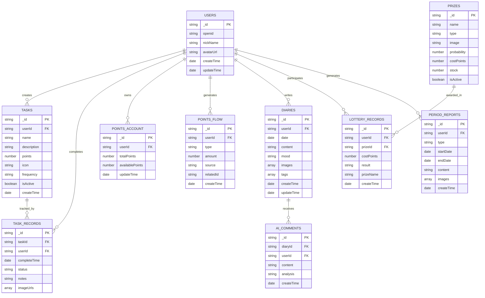

# 成长日记 - 技术架构文档

## 1. 架构设计


## 2. 技术描述

- **前端**：微信小程序原生开发 + Vant Weapp@1.11.4 + 微信云开发SDK
- **后端**：微信云开发（云函数 Node.js 18）
- **数据库**：微信云数据库（MongoDB）
- **存储**：微信云存储
- **AI服务**：扣子工作流API

## 3. 路由定义

| 路由 | 用途 |
|------|------|
| /pages/index/index | 首页，显示用户信息、今日任务进度、快速操作入口 |
| /pages/tasks/list | 任务列表页，管理和执行日常任务 |
| /pages/tasks/edit | 任务编辑页，创建和修改任务配置 |
| /pages/lottery/hall | 抽奖大厅，展示奖品和执行抽奖操作 |
| /pages/lottery/record | 抽奖记录页，查看历史抽奖结果 |
| /pages/diary/write | 写日记页，创建和编辑日记内容 |
| /pages/diary/list | 日记列表页，浏览历史日记记录 |
| /pages/diary/detail | 日记详情页，查看完整日记和AI评论 |
| /pages/reports/weekly | 周报页面，展示周度成长数据分析 |
| /pages/reports/monthly | 月报页面，展示月度成长报告 |
| /pages/profile/points | 积分明细页，查看积分收支流水 |
| /pages/profile/settings | 设置页面，管理个人信息和应用设置 |

## 4. API定义

### 4.1 核心云函数API

**用户认证相关**
```
云函数：userAuth
```

功能：用户登录和信息获取

参数：
| 参数名称 | 参数类型 | 是否必需 | 描述 |
|----------|----------|----------|------|
| code | string | true | 微信登录凭证 |
| userInfo | object | false | 用户基本信息 |

返回：
| 参数名称 | 参数类型 | 描述 |
|----------|----------|------|
| openid | string | 用户唯一标识 |
| sessionKey | string | 会话密钥 |
| userInfo | object | 用户信息 |

**任务管理相关**
```
云函数：taskManager
```

功能：任务的增删改查和打卡操作

参数：
| 参数名称 | 参数类型 | 是否必需 | 描述 |
|----------|----------|----------|------|
| action | string | true | 操作类型：create/update/delete/checkin |
| taskId | string | false | 任务ID（更新、删除、打卡时必需） |
| taskData | object | false | 任务数据（创建、更新时必需） |
| checkinData | object | false | 打卡数据（打卡时必需） |

返回：
| 参数名称 | 参数类型 | 描述 |
|----------|----------|------|
| success | boolean | 操作是否成功 |
| data | object | 返回的数据 |
| message | string | 操作结果消息 |

**积分管理相关**
```
云函数：pointsManager
```

功能：积分的增减和流水查询

参数：
| 参数名称 | 参数类型 | 是否必需 | 描述 |
|----------|----------|----------|------|
| action | string | true | 操作类型：add/consume/getFlow/getBalance |
| amount | number | false | 积分数量 |
| source | string | false | 积分来源 |
| relatedId | string | false | 关联记录ID |

**抽奖系统相关**
```
云函数：lotteryManager
```

功能：抽奖执行和记录管理

参数：
| 参数名称 | 参数类型 | 是否必需 | 描述 |
|----------|----------|----------|------|
| action | string | true | 操作类型：draw/getRecords/getPrizes |
| prizeId | string | false | 奖品ID（抽奖时必需） |

**AI评论生成**
```
云函数：generateAIComment
```

功能：基于日记内容生成AI评论，通过扣子工作流实现

参数：
| 参数名称 | 参数类型 | 是否必需 | 描述 |
|----------|----------|----------|------|
| diaryId | string | true | 日记ID |
| userId | string | true | 用户ID |

返回：
| 参数名称 | 参数类型 | 描述 |
|----------|----------|------|
| success | boolean | 生成是否成功 |
| comment | string | AI生成的评论内容 |
| analysis | string | 情感分析结果 |

**周期报告生成**
```
云函数：generatePeriodReport
```

功能：生成周期性成长报告，通过扣子工作流实现

参数：
| 参数名称 | 参数类型 | 是否必需 | 描述 |
|----------|----------|----------|------|
| userId | string | true | 用户ID |
| periodType | string | true | 报告类型：weekly/monthly |
| startDate | string | true | 开始日期 |
| endDate | string | true | 结束日期 |

返回：
| 参数名称 | 参数类型 | 描述 |
|----------|----------|------|
| success | boolean | 生成是否成功 |
| report | object | 生成的报告内容 |
| summary | string | 报告摘要 |

**图片标签生成**
```
云函数：generateImageTags
```

功能：基于上传图片生成标签和描述，通过扣子工作流实现

参数：
| 参数名称 | 参数类型 | 是否必需 | 描述 |
|----------|----------|----------|------|
| imageUrl | string | true | 图片云存储URL |
| userId | string | true | 用户ID |

返回：
| 参数名称 | 参数类型 | 描述 |
|----------|----------|------|
| success | boolean | 生成是否成功 |
| tags | array | 图片标签数组 |
| description | string | 图片描述 |

## 5. 服务架构图


## 6. 数据模型

### 6.1 数据模型定义



### 6.2 数据定义语言

**用户表 (users)**
```sql
-- 创建用户集合（云数据库自动创建）
-- 索引配置
db.users.createIndex({"openid": 1}, {"unique": true})
db.users.createIndex({"createTime": -1})

-- 权限配置
-- 允许认证用户读写自己的数据
{
  "read": "auth.openid == resource.openid",
  "write": "auth.openid == resource.openid"
}
```

**任务表 (tasks)**
```sql
-- 索引配置
db.tasks.createIndex({"userId": 1, "isActive": 1})
db.tasks.createIndex({"createTime": -1})

-- 权限配置
{
  "read": "auth.openid == resource.userId",
  "write": "auth.openid == resource.userId"
}

-- 初始化数据
db.tasks.add({
  name: "按时起床",
  description: "每天早上7点前起床",
  points: 10,
  icon: "alarm-clock",
  frequency: "daily",
  isActive: true,
  userId: "default",
  createTime: new Date()
})
```

**打卡记录表 (taskRecords)**
```sql
-- 索引配置
db.taskRecords.createIndex({"userId": 1, "completeTime": -1})
db.taskRecords.createIndex({"taskId": 1, "completeTime": -1})

-- 权限配置
{
  "read": "auth.openid == resource.userId",
  "write": "auth.openid == resource.userId"
}
```

**积分账户表 (pointsAccount)**
```sql
-- 索引配置
db.pointsAccount.createIndex({"userId": 1}, {"unique": true})

-- 权限配置
{
  "read": "auth.openid == resource.userId",
  "write": false  // 只能通过云函数修改
}
```

**积分流水表 (pointsFlow)**
```sql
-- 索引配置
db.pointsFlow.createIndex({"userId": 1, "createTime": -1})
db.pointsFlow.createIndex({"type": 1, "createTime": -1})

-- 权限配置
{
  "read": "auth.openid == resource.userId",
  "write": false  // 只能通过云函数创建
}
```

**奖品表 (prizes)**
```sql
-- 索引配置
db.prizes.createIndex({"isActive": 1, "costPoints": 1})

-- 权限配置
{
  "read": true,  // 所有用户可读
  "write": false  // 只能通过管理后台修改
}

-- 初始化数据
db.prizes.add([
  {
    name: "小红花贴纸",
    type: "virtual",
    image: "sticker_flower.png",
    probability: 0.3,
    costPoints: 50,
    stock: 999,
    isActive: true
  },
  {
    name: "彩色铅笔套装",
    type: "physical",
    image: "pencil_set.png", 
    probability: 0.1,
    costPoints: 200,
    stock: 10,
    isActive: true
  }
])
```

**抽奖记录表 (lotteryRecords)**
```sql
-- 索引配置
db.lotteryRecords.createIndex({"userId": 1, "createTime": -1})
db.lotteryRecords.createIndex({"result": 1, "createTime": -1})

-- 权限配置
{
  "read": "auth.openid == resource.userId",
  "write": false  // 只能通过云函数创建
}
```

**日记表 (diaries)**
```sql
-- 索引配置
db.diaries.createIndex({"userId": 1, "date": -1})
db.diaries.createIndex({"tags": 1, "createTime": -1})

-- 权限配置
{
  "read": "auth.openid == resource.userId",
  "write": "auth.openid == resource.userId"
}
```

**AI评论表 (aiComments)**
```sql
-- 索引配置
db.aiComments.createIndex({"diaryId": 1})
db.aiComments.createIndex({"userId": 1, "createTime": -1})

-- 权限配置
{
  "read": "auth.openid == resource.userId",
  "write": false  // 只能通过云函数创建
}
```

**周期报告表 (periodReports)**
```sql
-- 索引配置
db.periodReports.createIndex({"userId": 1, "type": 1, "startDate": -1})

-- 权限配置
{
  "read": "auth.openid == resource.userId", 
  "write": false  // 只能通过云函数创建
}
```

**图片元数据表 (imageMetadata)**
```sql
-- 索引配置
db.imageMetadata.createIndex({"userId": 1, "uploadTime": -1})
db.imageMetadata.createIndex({"relatedRecord": 1})

-- 权限配置
{
  "read": "auth.openid == resource.userId",
  "write": "auth.openid == resource.userId"
}
```

## 7. 扣子工作流集成方案

### 7.1 扣子工作流配置

**AI评论生成工作流**
- **工作流名称**：diary-comment-generator
- **输入参数**：
  - diaryContent: 日记内容
  - mood: 心情状态
  - taskCompletion: 当日任务完成情况
  - userAge: 用户年龄段
- **输出结果**：
  - comment: 鼓励性评论内容
  - analysis: 情感分析结果
  - suggestions: 成长建议

**周期报告生成工作流**
- **工作流名称**：period-report-generator
- **输入参数**：
  - userId: 用户ID
  - periodData: 周期内数据统计
  - taskStats: 任务完成统计
  - moodTrends: 心情变化趋势
  - diaryHighlights: 日记亮点摘要
- **输出结果**：
  - reportContent: 结构化报告内容
  - summary: 报告摘要
  - achievements: 成就亮点
  - recommendations: 改进建议

**图片标签生成工作流**
- **工作流名称**：image-tag-generator
- **输入参数**：
  - imageUrl: 图片URL
  - context: 上传上下文（日记/任务打卡）
- **输出结果**：
  - tags: 图片标签数组
  - description: 图片描述
  - emotions: 情感标签

### 7.2 API调用配置

**扣子工作流API配置**
```javascript
// 云函数中的扣子API配置
const COZE_CONFIG = {
  baseURL: 'https://api.coze.cn/open_api/v2/chat',
  apiKey: process.env.COZE_API_KEY, // 环境变量配置
  timeout: 30000,
  retryTimes: 3
}

// 工作流ID配置
const WORKFLOW_IDS = {
  DIARY_COMMENT: 'workflow_diary_comment_xxx',
  PERIOD_REPORT: 'workflow_period_report_xxx', 
  IMAGE_TAGS: 'workflow_image_tags_xxx'
}
```

**API调用示例**
```javascript
// AI评论生成调用
async function callCozeWorkflow(workflowId, inputData) {
  const response = await fetch(COZE_CONFIG.baseURL, {
    method: 'POST',
    headers: {
      'Authorization': `Bearer ${COZE_CONFIG.apiKey}`,
      'Content-Type': 'application/json'
    },
    body: JSON.stringify({
      workflow_id: workflowId,
      parameters: inputData,
      stream: false
    })
  })
  
  return await response.json()
}
```

### 7.3 数据流设计

**AI评论生成流程**


**周期报告生成流程**


### 7.4 错误处理和重试机制

**错误处理策略**
```javascript
// 扣子API调用错误处理
async function callCozeWithRetry(workflowId, inputData, retryCount = 0) {
  try {
    const result = await callCozeWorkflow(workflowId, inputData)
    
    if (result.code !== 0) {
      throw new Error(`扣子工作流调用失败: ${result.msg}`)
    }
    
    return result.data
  } catch (error) {
    if (retryCount < COZE_CONFIG.retryTimes) {
      console.log(`重试第 ${retryCount + 1} 次...`)
      await sleep(1000 * (retryCount + 1)) // 递增延迟
      return callCozeWithRetry(workflowId, inputData, retryCount + 1)
    }
    
    // 达到最大重试次数，返回默认内容
    return getDefaultAIResponse(workflowId)
  }
}

// 默认AI响应内容
function getDefaultAIResponse(workflowId) {
  const defaults = {
    [WORKFLOW_IDS.DIARY_COMMENT]: {
      comment: "今天的日记写得很棒！继续保持这样的好习惯！",
      analysis: "积极正面",
      suggestions: "可以尝试记录更多生活中的小细节哦！"
    },
    [WORKFLOW_IDS.PERIOD_REPORT]: {
      reportContent: "本周表现良好，继续努力！",
      summary: "整体进步明显",
      achievements: ["坚持写日记", "按时完成任务"],
      recommendations: ["保持良好习惯", "尝试新的挑战"]
    }
  }
  
  return defaults[workflowId] || {}
}
```

### 7.5 性能优化

**缓存策略**
- AI评论生成：相似内容24小时内复用
- 周期报告：同一周期报告缓存7天
- 图片标签：相同图片标签永久缓存

**异步处理**
- AI评论生成：异步处理，先返回"正在生成中"状态
- 周期报告：定时任务预生成，提升用户体验
- 图片标签：上传后异步生成，不阻塞用户操作
