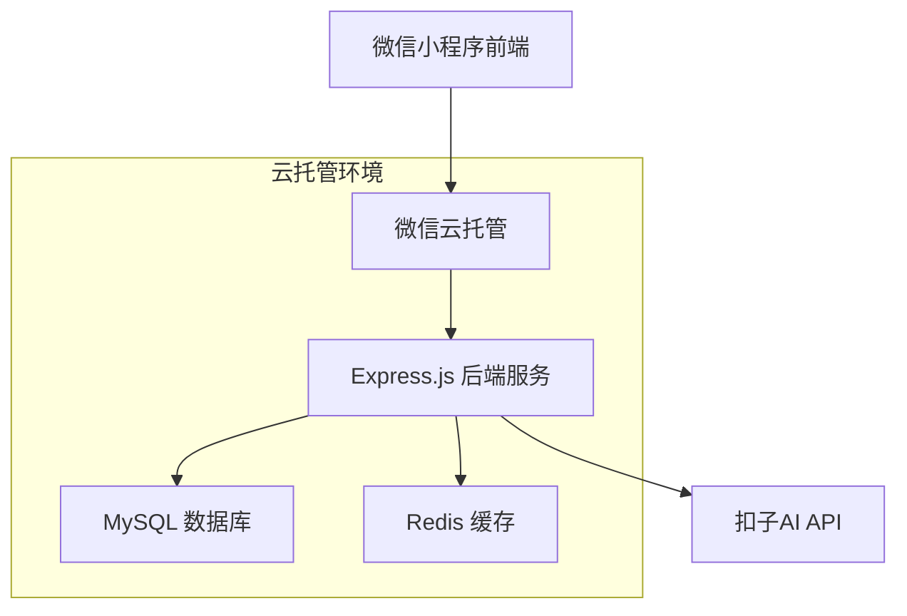

# 成长日记小程序云托管后端设计方案

## 1. 项目概述

### 1.1 现状分析
目前成长日记小程序使用微信小程序本地存储（`wx.setStorageSync`），存在以下问题：
- 用户卸载小程序后数据丢失
- 换设备后无法同步数据
- 无法多设备共享数据
- 数据无法备份和恢复

### 1.2 解决方案
通过微信云托管部署 Express.js 后端服务，使用 MySQL 数据库实现数据持久化存储，确保用户数据安全和跨设备同步。

## 2. 技术架构

### 2.1 整体架构


### 2.2 技术栈
- **前端**: 微信小程序原生开发
- **后端**: Express.js + Node.js
- **数据库**: MySQL 8.0
- **缓存**: Redis
- **部署**: 微信云托管 (prod-5gxze52ea2824f38)
- **服务名**: express-kxu5

## 3. 数据库设计

### 3.1 数据库表结构

#### 用户表 (users)
```sql
CREATE TABLE users (
    id INT PRIMARY KEY AUTO_INCREMENT,
    openid VARCHAR(100) UNIQUE NOT NULL COMMENT '微信用户唯一标识',
    nickname VARCHAR(100) DEFAULT '' COMMENT '用户昵称',
    avatar_url VARCHAR(500) DEFAULT '' COMMENT '头像URL',
    points INT DEFAULT 0 COMMENT '用户积分',
    total_diaries INT DEFAULT 0 COMMENT '总日记数',
    continuous_days INT DEFAULT 0 COMMENT '连续记录天数',
    last_diary_date DATE NULL COMMENT '最后记录日期',
    created_at TIMESTAMP DEFAULT CURRENT_TIMESTAMP,
    updated_at TIMESTAMP DEFAULT CURRENT_TIMESTAMP ON UPDATE CURRENT_TIMESTAMP,
    INDEX idx_openid (openid),
    INDEX idx_created_at (created_at)
);
```

#### 日记表 (diaries)
```sql
CREATE TABLE diaries (
    id INT PRIMARY KEY AUTO_INCREMENT,
    user_id INT NOT NULL,
    diary_date DATE NOT NULL COMMENT '日记日期',
    content TEXT NOT NULL COMMENT '日记内容',
    mood VARCHAR(20) DEFAULT '' COMMENT '心情',
    weather VARCHAR(20) DEFAULT '' COMMENT '天气',
    images JSON NULL COMMENT '图片列表',
    tags JSON NULL COMMENT '标签列表',
    ai_comment TEXT NULL COMMENT 'AI评价',
    is_draft BOOLEAN DEFAULT FALSE COMMENT '是否草稿',
    created_at TIMESTAMP DEFAULT CURRENT_TIMESTAMP,
    updated_at TIMESTAMP DEFAULT CURRENT_TIMESTAMP ON UPDATE CURRENT_TIMESTAMP,
    FOREIGN KEY (user_id) REFERENCES users(id) ON DELETE CASCADE,
    UNIQUE KEY uk_user_date (user_id, diary_date),
    INDEX idx_user_id (user_id),
    INDEX idx_diary_date (diary_date),
    INDEX idx_created_at (created_at)
);
```

#### 任务表 (tasks)
```sql
CREATE TABLE tasks (
    id INT PRIMARY KEY AUTO_INCREMENT,
    user_id INT NOT NULL,
    title VARCHAR(200) NOT NULL COMMENT '任务标题',
    description TEXT DEFAULT '' COMMENT '任务描述',
    category VARCHAR(50) DEFAULT 'daily' COMMENT '任务分类',
    points_reward INT DEFAULT 10 COMMENT '完成奖励积分',
    is_system BOOLEAN DEFAULT FALSE COMMENT '是否系统任务',
    is_completed BOOLEAN DEFAULT FALSE COMMENT '是否完成',
    completed_at TIMESTAMP NULL COMMENT '完成时间',
    task_date DATE NOT NULL COMMENT '任务日期',
    created_at TIMESTAMP DEFAULT CURRENT_TIMESTAMP,
    updated_at TIMESTAMP DEFAULT CURRENT_TIMESTAMP ON UPDATE CURRENT_TIMESTAMP,
    FOREIGN KEY (user_id) REFERENCES users(id) ON DELETE CASCADE,
    INDEX idx_user_id (user_id),
    INDEX idx_task_date (task_date),
    INDEX idx_category (category)
);
```

#### 积分记录表 (point_records)
```sql
CREATE TABLE point_records (
    id INT PRIMARY KEY AUTO_INCREMENT,
    user_id INT NOT NULL,
    amount INT NOT NULL COMMENT '积分变动数量(正数为增加，负数为扣除)',
    source VARCHAR(100) NOT NULL COMMENT '积分来源',
    description VARCHAR(500) DEFAULT '' COMMENT '详细描述',
    related_id INT NULL COMMENT '关联记录ID(如任务ID、抽奖ID等)',
    related_type VARCHAR(50) NULL COMMENT '关联类型(task/lottery/diary等)',
    created_at TIMESTAMP DEFAULT CURRENT_TIMESTAMP,
    FOREIGN KEY (user_id) REFERENCES users(id) ON DELETE CASCADE,
    INDEX idx_user_id (user_id),
    INDEX idx_created_at (created_at),
    INDEX idx_source (source)
);
```

#### 抽奖奖品表 (lottery_prizes)
```sql
CREATE TABLE lottery_prizes (
    id INT PRIMARY KEY AUTO_INCREMENT,
    name VARCHAR(200) NOT NULL COMMENT '奖品名称',
    description TEXT DEFAULT '' COMMENT '奖品描述',
    image_url VARCHAR(500) DEFAULT '' COMMENT '奖品图片',
    probability DECIMAL(5,4) NOT NULL COMMENT '中奖概率(0-1)',
    stock INT DEFAULT -1 COMMENT '库存数量(-1表示无限)',
    is_active BOOLEAN DEFAULT TRUE COMMENT '是否启用',
    created_at TIMESTAMP DEFAULT CURRENT_TIMESTAMP,
    updated_at TIMESTAMP DEFAULT CURRENT_TIMESTAMP ON UPDATE CURRENT_TIMESTAMP,
    INDEX idx_is_active (is_active)
);
```

#### 抽奖记录表 (lottery_records)
```sql
CREATE TABLE lottery_records (
    id INT PRIMARY KEY AUTO_INCREMENT,
    user_id INT NOT NULL,
    prize_id INT NULL COMMENT '中奖奖品ID(NULL表示未中奖)',
    cost_points INT NOT NULL COMMENT '消耗积分',
    is_winner BOOLEAN DEFAULT FALSE COMMENT '是否中奖',
    created_at TIMESTAMP DEFAULT CURRENT_TIMESTAMP,
    FOREIGN KEY (user_id) REFERENCES users(id) ON DELETE CASCADE,
    FOREIGN KEY (prize_id) REFERENCES lottery_prizes(id) ON DELETE SET NULL,
    INDEX idx_user_id (user_id),
    INDEX idx_created_at (created_at)
);
```

### 3.2 初始化数据

#### 系统任务数据
```sql
INSERT INTO lottery_prizes (name, description, probability, stock) VALUES
('小红花', '表扬奖励', 0.3, -1),
('小星星', '鼓励奖励', 0.25, -1),
('彩虹贴纸', '漂亮贴纸', 0.2, -1),
('小徽章', '成就徽章', 0.15, -1),
('神秘礼物', '特殊奖励', 0.1, -1);
```

## 4. API 接口设计

### 4.1 用户相关接口

#### 用户登录/注册
```
POST /api/auth/login
```
**请求参数:**
| 参数名 | 类型 | 必填 | 描述 |
|--------|------|------|------|
| code | string | 是 | 微信登录凭证 |

**响应数据:**
```json
{
  "success": true,
  "data": {
    "token": "jwt_token",
    "userInfo": {
      "id": 1,
      "openid": "xxx",
      "nickname": "用户昵称",
      "avatar": "头像URL",
      "points": 100
    }
  }
}
```

#### 获取用户信息
```
GET /api/user/profile
```

#### 更新用户信息
```
PUT /api/user/profile
```

### 4.2 日记相关接口

#### 创建日记
```
POST /api/diary/create
```
**请求参数:**
```json
{
  "date": "2025-01-18",
  "content": "今天很开心...",
  "mood": "happy",
  "weather": "sunny",
  "images": ["image1.jpg", "image2.jpg"],
  "tags": ["学习", "开心"],
  "isDraft": false
}
```

#### 获取日记列表
```
GET /api/diary/list?page=1&limit=10&month=2025-01
```

#### 获取日记详情
```
GET /api/diary/:id
```

#### 更新日记
```
PUT /api/diary/:id
```

#### 删除日记
```
DELETE /api/diary/:id
```

### 4.3 任务相关接口

#### 获取任务列表
```
GET /api/task/list?date=2025-01-18
```

#### 完成任务
```
POST /api/task/:id/complete
```

#### 创建自定义任务
```
POST /api/task/create
```

### 4.4 积分相关接口

#### 获取积分余额
```
GET /api/points/balance
```

#### 获取积分记录
```
GET /api/points/records?page=1&limit=20
```

#### 增加积分
```
POST /api/points/add
```
**请求参数:**
```json
{
  "amount": 10,
  "source": "完成任务",
  "description": "完成每日阅读任务",
  "relatedId": 123,
  "relatedType": "task"
}
```

#### 扣除积分
```
POST /api/points/deduct
```

### 4.5 抽奖相关接口

#### 获取奖品列表
```
GET /api/lottery/prizes
```

#### 执行抽奖
```
POST /api/lottery/draw
```

#### 获取抽奖记录
```
GET /api/lottery/records?page=1&limit=20
```

### 4.6 AI相关接口

#### AI生成图片
```
POST /api/ai/generate-image
```
**请求参数:**
```json
{
  "content": "今天去公园玩",
  "mood": "happy",
  "weather": "sunny"
}
```

#### AI评价日记
```
POST /api/ai/comment-diary
```

## 5. 数据迁移方案

### 5.1 迁移策略
1. **渐进式迁移**: 用户首次使用新版本时自动迁移本地数据
2. **双写模式**: 迁移期间同时写入本地和云端
3. **数据校验**: 迁移后验证数据完整性

### 5.2 迁移流程
```javascript
// 小程序端迁移逻辑
async function migrateLocalData() {
  try {
    // 1. 检查是否已迁移
    const migrated = wx.getStorageSync('dataMigrated');
    if (migrated) return;
    
    // 2. 获取本地数据
    const localDiaries = wx.getStorageSync('diaries') || [];
    const localTasks = wx.getStorageSync('userTasks') || [];
    const localPoints = wx.getStorageSync('points') || 0;
    
    // 3. 批量上传到云端
    await uploadDiaries(localDiaries);
    await uploadTasks(localTasks);
    await updatePoints(localPoints);
    
    // 4. 标记已迁移
    wx.setStorageSync('dataMigrated', true);
    
    wx.showToast({
      title: '数据迁移完成',
      icon: 'success'
    });
  } catch (error) {
    console.error('数据迁移失败:', error);
  }
}
```

## 6. 数据同步机制

### 6.1 离线缓存策略
1. **读取优先级**: 缓存 → 网络 → 本地存储
2. **写入策略**: 网络优先，失败时存入待同步队列
3. **同步时机**: 网络恢复时、应用启动时

### 6.2 冲突解决
1. **时间戳优先**: 以最新修改时间为准
2. **服务端优先**: 发生冲突时以服务端数据为准
3. **用户选择**: 重要数据冲突时提示用户选择

## 7. 安全与隐私

### 7.1 数据安全
- JWT Token 认证
- API 接口权限控制
- 数据库连接加密
- 敏感数据脱敏

### 7.2 隐私保护
- 用户数据隔离
- 最小权限原则
- 数据匿名化处理
- 符合微信小程序隐私规范

## 8. 性能优化

### 8.1 数据库优化
- 合理设计索引
- 分页查询
- 连接池管理
- 慢查询监控

### 8.2 缓存策略
- Redis 缓存热点数据
- 本地缓存减少网络请求
- CDN 加速静态资源

## 9. 监控与运维

### 9.1 日志记录
- API 访问日志
- 错误日志记录
- 性能监控日志
- 用户行为日志

### 9.2 告警机制
- 服务异常告警
- 数据库性能告警
- 存储空间告警
- 用户异常行为告警

## 10. 部署配置

### 10.1 环境配置
```javascript
// 生产环境配置
const config = {
  database: {
    host: process.env.DB_HOST,
    port: process.env.DB_PORT,
    username: process.env.DB_USER,
    password: process.env.DB_PASSWORD,
    database: process.env.DB_NAME
  },
  redis: {
    host: process.env.REDIS_HOST,
    port: process.env.REDIS_PORT,
    password: process.env.REDIS_PASSWORD
  },
  jwt: {
    secret: process.env.JWT_SECRET,
    expiresIn: '7d'
  }
};
```

### 10.2 Docker 配置
```dockerfile
FROM node:18-alpine
WORKDIR /app
COPY package*.json ./
RUN npm ci --only=production
COPY . .
EXPOSE 3000
CMD ["npm", "start"]
```

## 11. 实施计划

### 11.1 开发阶段
1. **第一阶段** (1-2周): 数据库设计和基础API开发
2. **第二阶段** (1周): 小程序端集成和数据迁移
3. **第三阶段** (1周): 测试和优化

### 11.2 上线计划
1. **灰度发布**: 小范围用户测试
2. **全量发布**: 逐步开放给所有用户
3. **监控观察**: 密切关注系统稳定性

通过以上方案，可以将成长日记小程序从本地存储升级为云端数据存储，实现数据持久化、跨设备同步和更好的用户体验。