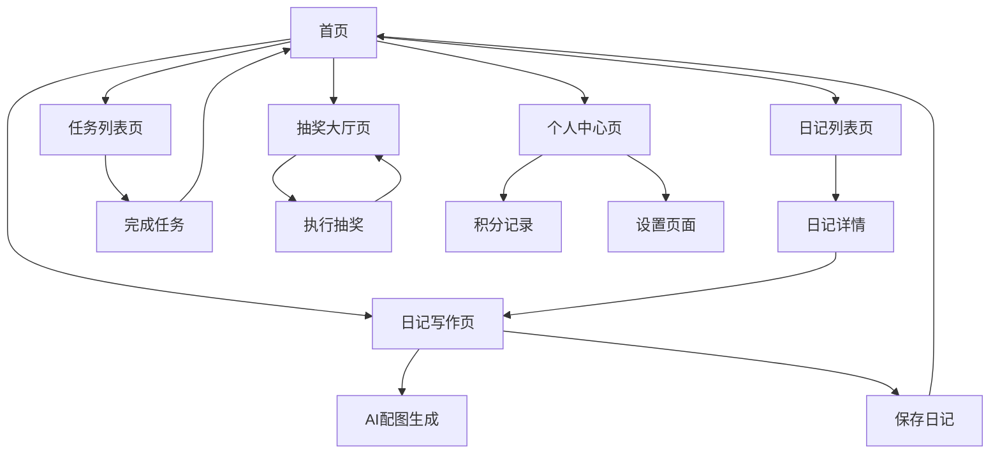

# 成长日记小程序产品需求文档

## 1. 产品概述

成长日记是一款专为个人成长记录设计的微信小程序，帮助用户养成每日记录习惯，通过AI智能配图和积分激励系统，让记录生活变得更有趣和有意义。
产品旨在解决用户缺乏记录习惯、记录过程枯燥、数据易丢失等问题，为追求自我提升的用户群体提供便捷的数字化成长记录工具。
目标是成为用户日常生活记录的首选工具，培养用户长期记录习惯，构建个人成长数据资产。

## 2. 核心功能

### 2.1 用户角色

| 角色 | 注册方式 | 核心权限 |
|------|----------|----------|
| 普通用户 | 微信授权登录 | 记录日记、完成任务、获得积分、参与抽奖、使用AI功能 |

### 2.2 功能模块

我们的成长日记小程序包含以下主要页面：
1. **首页**: 用户信息展示、快速记录入口、每日任务、积分显示
2. **日记写作页**: 日期选择、心情选择、天气选择、内容编辑、AI配图生成
3. **日记列表页**: 历史日记浏览、按月份筛选、日记搜索
4. **任务列表页**: 每日任务展示、任务完成、积分奖励
5. **抽奖大厅页**: 积分抽奖、奖品展示、中奖记录
6. **个人中心页**: 用户信息、积分记录、设置选项

### 2.3 页面详情

| 页面名称 | 模块名称 | 功能描述 |
|----------|----------|----------|
| 首页 | 用户信息区 | 显示用户头像、昵称、当前积分、连续记录天数 |
| 首页 | 快速记录 | 一键进入日记写作页面，显示今日是否已记录 |
| 首页 | 每日任务 | 展示当日可完成的任务列表，显示完成状态和奖励积分 |
| 首页 | 统计信息 | 显示总记录天数、本月记录天数等统计数据 |
| 日记写作页 | 日期选择器 | 选择记录日期，默认为当天，支持选择历史日期 |
| 日记写作页 | 心情选择 | 提供多种心情选项（开心、平静、难过等），支持自定义 |
| 日记写作页 | 天气选择 | 提供天气选项（晴天、雨天、阴天等），支持自定义 |
| 日记写作页 | 内容编辑 | 文本输入框，支持多行文本，实时字数统计 |
| 日记写作页 | AI配图生成 | 根据日记内容、心情、天气调用AI生成相关图片 |
| 日记写作页 | 保存功能 | 保存日记到本地存储，支持草稿保存 |
| 日记列表页 | 日记展示 | 按时间倒序展示历史日记，显示日期、心情、天气、内容摘要 |
| 日记列表页 | 月份筛选 | 支持按月份筛选日记，快速定位特定时期的记录 |
| 日记列表页 | 搜索功能 | 支持按关键词搜索日记内容 |
| 日记列表页 | 详情查看 | 点击日记可查看完整内容和AI生成的图片 |
| 任务列表页 | 任务展示 | 显示每日任务列表，包括任务名称、描述、奖励积分 |
| 任务列表页 | 任务完成 | 点击完成任务，获得相应积分奖励 |
| 任务列表页 | 进度跟踪 | 显示任务完成进度和连续完成天数 |
| 抽奖大厅页 | 奖品展示 | 展示可抽取的奖品列表，显示奖品图片和名称 |
| 抽奖大厅页 | 抽奖功能 | 消耗积分进行抽奖，支持转盘或卡片抽奖形式 |
| 抽奖大厅页 | 中奖记录 | 显示历史中奖记录和奖品获得情况 |
| 个人中心页 | 用户信息 | 显示和编辑用户基本信息，如昵称、头像 |
| 个人中心页 | 积分记录 | 显示积分获得和消耗的详细记录 |
| 个人中心页 | 设置选项 | 提供通知设置、隐私设置等个性化配置 |

## 3. 核心流程

### 普通用户流程

**日记记录流程**: 用户进入小程序 → 点击快速记录或从首页进入写作页 → 选择日期、心情、天气 → 输入日记内容 → 可选择生成AI配图 → 保存日记 → 获得积分奖励

**任务完成流程**: 用户查看每日任务 → 完成相应任务（如记录日记、连续记录等） → 点击完成任务 → 获得积分奖励 → 积分累计到个人账户

**抽奖参与流程**: 用户积累足够积分 → 进入抽奖大厅 → 选择参与抽奖 → 消耗积分 → 获得奖品或安慰奖 → 查看中奖记录

## 4. 用户界面设计

### 4.1 设计风格

- **主色调**: 温暖橙色 (#FF6B35) 作为主色，传达积极向上的情感
- **辅助色**: 柔和蓝色 (#4ECDC4) 和浅灰色 (#F7F7F7) 作为辅助色
- **按钮样式**: 圆角矩形按钮，主按钮使用渐变效果，次要按钮使用描边样式
- **字体**: 微信默认字体，标题使用 18px 加粗，正文使用 14px 常规，辅助信息使用 12px
- **布局风格**: 卡片式布局，顶部导航栏，底部标签栏导航
- **图标风格**: 使用线性图标风格，配合适当的emoji表情增加亲和力

### 4.2 页面设计概览

| 页面名称 | 模块名称 | UI元素 |
|----------|----------|---------|
| 首页 | 用户信息区 | 圆形头像、用户昵称、积分数字徽章、连续天数进度条，使用渐变背景卡片 |
| 首页 | 快速记录 | 大号圆形悬浮按钮，橙色渐变，带有编辑图标，固定在右下角 |
| 首页 | 每日任务 | 横向滑动卡片列表，每个任务卡片显示图标、标题、进度条和积分奖励 |
| 日记写作页 | 日期选择器 | 日历样式选择器，高亮当前日期，支持左右滑动切换月份 |
| 日记写作页 | 心情选择 | 横向排列的emoji表情按钮，选中状态有放大和高亮效果 |
| 日记写作页 | 内容编辑 | 多行文本输入框，占据页面主要区域，底部显示字数统计 |
| 日记写作页 | AI配图按钮 | 渐变色按钮，带有魔法棒图标，点击后显示加载动画 |
| 日记列表页 | 日记卡片 | 白色圆角卡片，左侧显示日期和心情图标，右侧显示内容摘要 |
| 任务列表页 | 任务卡片 | 带有完成状态的卡片，未完成显示灰色，已完成显示绿色勾选 |
| 抽奖大厅页 | 转盘抽奖 | 彩色转盘界面，中央有抽奖按钮，周围显示奖品图标和名称 |
| 个人中心页 | 设置列表 | 列表样式布局，每项设置带有图标和右箭头，支持开关切换 |

### 4.3 响应式设计

产品采用移动端优先设计，专为微信小程序环境优化，支持不同尺寸手机屏幕适配。界面元素采用相对单位设计，确保在不同设备上保持良好的视觉效果和交互体验。考虑触摸交互优化，按钮和可点击区域不小于44px，支持手势操作如滑动和长按。