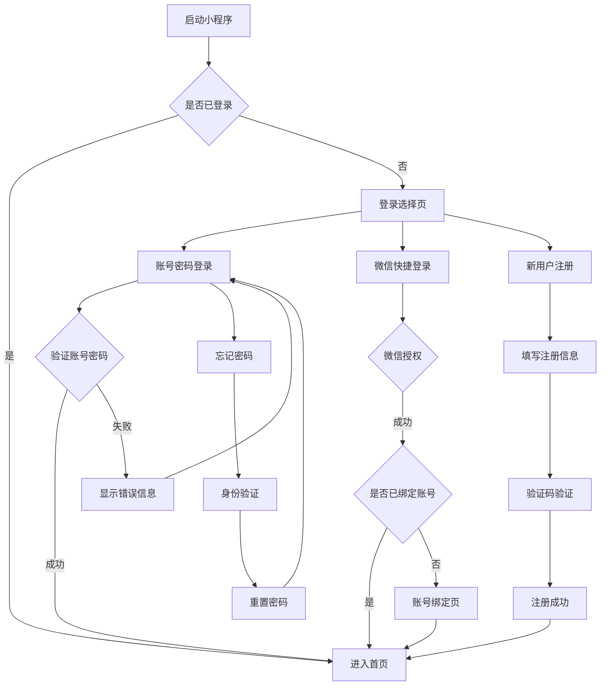

# 成长日记账号密码登录系统 - 产品需求文档

## 1. 产品概述

为成长日记小程序增加账号密码登录功能，提供除微信授权外的另一种用户认证方式，满足用户多样化的登录需求。
该系统将与现有微信登录机制并存，用户可选择任一方式进行登录，实现账户数据的统一管理和跨平台同步。

## 2. 核心功能

### 2.1 用户角色

| 角色 | 注册方式 | 核心权限 |
|------|----------|----------|
| 普通用户 | 手机号/邮箱注册 | 可使用所有基础功能，记录日记、完成任务、获得积分 |
| 微信用户 | 微信授权登录 | 与普通用户权限相同，可绑定账号密码实现双重登录 |

### 2.2 功能模块

我们的账号密码登录系统包含以下主要页面：
1. **登录页面**：账号密码输入、微信快捷登录、忘记密码入口
2. **注册页面**：用户信息填写、验证码验证、协议确认
3. **忘记密码页面**：手机号/邮箱验证、密码重置
4. **账号绑定页面**：微信用户绑定手机号/邮箱账号
5. **账号管理页面**：修改密码、绑定/解绑微信、账号安全设置

### 2.3 页面详情

| 页面名称 | 模块名称 | 功能描述 |
|----------|----------|----------|
| 登录页面 | 账号输入区 | 支持手机号/邮箱登录，密码输入，记住登录状态 |
| 登录页面 | 快捷登录区 | 微信一键登录按钮，第三方登录选项 |
| 登录页面 | 辅助功能区 | 忘记密码链接，新用户注册入口，游客模式 |
| 注册页面 | 基本信息 | 手机号/邮箱输入，昵称设置，密码设置和确认 |
| 注册页面 | 验证模块 | 短信/邮箱验证码发送和验证，图形验证码 |
| 注册页面 | 协议确认 | 用户协议和隐私政策阅读确认 |
| 忘记密码页面 | 身份验证 | 手机号/邮箱验证，验证码发送 |
| 忘记密码页面 | 密码重置 | 新密码设置，密码强度检测 |
| 账号绑定页面 | 绑定选择 | 选择绑定手机号或邮箱，输入验证信息 |
| 账号绑定页面 | 验证确认 | 验证码验证，绑定成功确认 |
| 账号管理页面 | 安全设置 | 修改密码，登录设备管理，安全日志查看 |
| 账号管理页面 | 绑定管理 | 微信绑定状态，手机号/邮箱绑定管理 |

## 3. 核心流程

### 普通用户注册登录流程
用户首次使用时选择注册新账号，填写手机号/邮箱和密码，通过验证码验证后完成注册。后续登录时输入账号密码即可快速进入应用。

### 微信用户绑定流程
已有微信登录的用户可在个人设置中选择绑定手机号或邮箱，完成绑定后可使用账号密码登录，实现双重登录方式。

### 密码找回流程
用户忘记密码时，通过手机号/邮箱验证身份，接收验证码后可重置新密码，确保账号安全。

## 4. 用户界面设计

### 4.1 设计风格
- 主色调：温暖橙色 #FF6B35，体现成长活力
- 辅助色：清新蓝绿 #4ECDC4，营造安全感
- 强调色：明亮黄色 #FFE66D，突出重要按钮
- 背景色：浅灰白色 #F8F9FA，保持清爽
- 按钮样式：圆角矩形，渐变色彩，微阴影效果
- 字体：系统默认字体，标题16px，正文14px，辅助文字12px
- 布局风格：卡片式设计，顶部导航，表单居中对齐
- 图标风格：线性图标，简洁现代，配合品牌色彩

### 4.2 页面设计概览

| 页面名称 | 模块名称 | UI元素 |
|----------|----------|---------|
| 登录页面 | 头部区域 | 品牌Logo，页面标题"欢迎回来"，背景渐变色 #FF6B35 到 #FFE66D |
| 登录页面 | 表单区域 | 白色卡片容器，圆角12px，账号输入框带图标，密码输入框带显示/隐藏切换 |
| 登录页面 | 按钮区域 | 主登录按钮渐变色，微信登录按钮绿色 #07C160，圆角8px |
| 注册页面 | 步骤指示 | 顶部进度条，当前步骤高亮显示，完成步骤显示对勾 |
| 注册页面 | 表单区域 | 分步骤表单，每步一个卡片，输入框带实时验证提示 |
| 忘记密码页面 | 引导区域 | 安全图标，温馨提示文字，步骤说明 |
| 账号管理页面 | 安全状态 | 安全等级显示，绿色表示安全，橙色提示需要完善 |

### 4.3 响应式设计
产品采用移动端优先设计，完全适配微信小程序环境，支持不同屏幕尺寸的iPhone和Android设备。界面元素采用相对单位，确保在各种分辨率下都有良好的显示效果。交互设计考虑触屏操作习惯，按钮大小不小于44px，间距合理，支持单手操作。