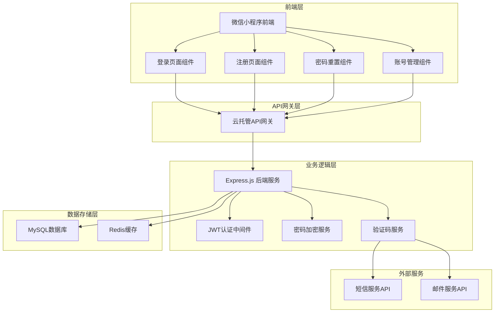
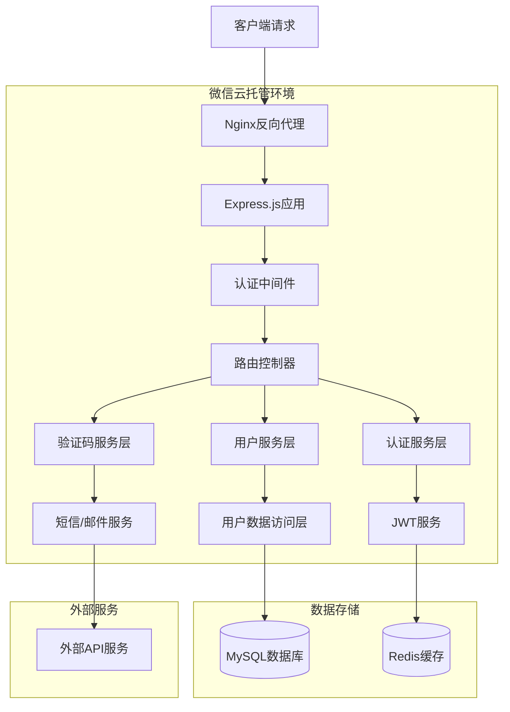
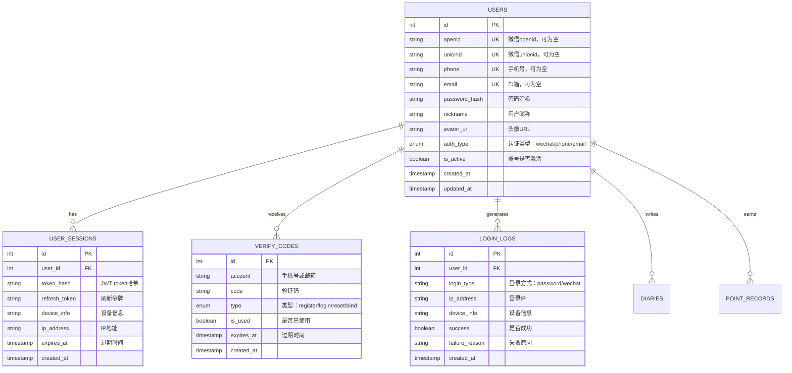

# 成长日记账号密码登录系统 - 技术架构文档

## 1. 架构设计



## 2. 技术描述

* 前端：微信小程序原生框架 + Vant Weapp UI组件库

* 后端：Express.js\@4 + bcryptjs\@2.4 + jsonwebtoken\@9.0

* 数据库：MySQL\@8.0 (通过微信云托管提供)

* 缓存：Redis\@7.0 (用于验证码和会话管理)

* 认证：JWT Token + bcrypt密码加密

* 验证服务：阿里云短信服务 + 邮件服务

## 3. 路由定义

| 路由                              | 用途                  |
| ------------------------------- | ------------------- |
| /pages/auth/login               | 登录页面，支持账号密码和微信登录    |
| /pages/auth/register            | 注册页面，用户信息填写和验证      |
| /pages/auth/forgot-password     | 忘记密码页面，密码重置流程       |
| /pages/auth/bind-account        | 账号绑定页面，微信用户绑定手机号/邮箱 |
| /pages/profile/account-security | 账号安全管理页面            |

## 4. API定义

### 4.1 用户认证相关API

**用户注册**

```
POST /api/auth/register
```

请求参数：

| 参数名        | 参数类型    | 是否必需 | 描述                |
| ---------- | ------- | ---- | ----------------- |
| phone      | string  | 否    | 手机号（手机号和邮箱二选一）    |
| email      | string  | 否    | 邮箱地址              |
| password   | string  | 是    | 密码（6-20位，包含字母和数字） |
| nickname   | string  | 是    | 用户昵称              |
| verifyCode | string  | 是    | 验证码               |
| agreeTerms | boolean | 是    | 是否同意用户协议          |

响应参数：

| 参数名      | 参数类型    | 描述      |
| -------- | ------- | ------- |
| success  | boolean | 注册是否成功  |
| message  | string  | 响应消息    |
| token    | string  | JWT认证令牌 |
| userInfo | object  | 用户基本信息  |

**用户登录**

```
POST /api/auth/login
```

请求参数：

| 参数名        | 参数类型    | 是否必需 | 描述         |
| ---------- | ------- | ---- | ---------- |
| account    | string  | 是    | 账号（手机号或邮箱） |
| password   | string  | 是    | 密码         |
| rememberMe | boolean | 否    | 是否记住登录状态   |

响应参数：

| 参数名          | 参数类型    | 描述        |
| ------------ | ------- | --------- |
| success      | boolean | 登录是否成功    |
| token        | string  | JWT认证令牌   |
| refreshToken | string  | 刷新令牌      |
| userInfo     | object  | 用户信息      |
| expiresIn    | number  | 令牌过期时间（秒） |

**微信登录绑定**

```
POST /api/auth/wechat-bind
```

请求参数：

| 参数名        | 参数类型   | 是否必需 | 描述          |
| ---------- | ------ | ---- | ----------- |
| openid     | string | 是    | 微信用户openid  |
| unionid    | string | 否    | 微信用户unionid |
| account    | string | 是    | 要绑定的手机号或邮箱  |
| verifyCode | string | 是    | 验证码         |

**发送验证码**

```
POST /api/auth/send-verify-code
```

请求参数：

| 参数名     | 参数类型   | 是否必需 | 描述                              |
| ------- | ------ | ---- | ------------------------------- |
| account | string | 是    | 手机号或邮箱                          |
| type    | string | 是    | 验证码类型：register/login/reset/bind |

**重置密码**

```
POST /api/auth/reset-password
```

请求参数：

| 参数名         | 参数类型   | 是否必需 | 描述     |
| ----------- | ------ | ---- | ------ |
| account     | string | 是    | 手机号或邮箱 |
| verifyCode  | string | 是    | 验证码    |
| newPassword | string | 是    | 新密码    |

### 4.2 用户管理相关API

**获取用户信息**

```
GET /api/users/profile
```

**修改密码**

```
POST /api/users/change-password
```

**绑定/解绑微信**

```
POST /api/users/bind-wechat
DELETE /api/users/unbind-wechat
```

**刷新Token**

```
POST /api/auth/refresh-token
```

## 5. 服务器架构图



## 6. 数据模型

### 6.1 数据模型定义



### 6.2 数据定义语言

**用户表 (users)**

```sql
-- 创建用户表
CREATE TABLE users (
    id INT PRIMARY KEY AUTO_INCREMENT,
    openid VARCHAR(100) UNIQUE NULL COMMENT '微信openid',
    unionid VARCHAR(100) UNIQUE NULL COMMENT '微信unionid',
    phone VARCHAR(20) UNIQUE NULL COMMENT '手机号',
    email VARCHAR(100) UNIQUE NULL COMMENT '邮箱地址',
    password_hash VARCHAR(255) NULL COMMENT '密码哈希',
    nickname VARCHAR(50) NOT NULL COMMENT '用户昵称',
    avatar_url VARCHAR(500) NULL COMMENT '头像URL',
    auth_type ENUM('wechat', 'phone', 'email') NOT NULL DEFAULT 'wechat' COMMENT '主要认证方式',
    is_active BOOLEAN DEFAULT TRUE COMMENT '账号是否激活',
    created_at TIMESTAMP DEFAULT CURRENT_TIMESTAMP,
    updated_at TIMESTAMP DEFAULT CURRENT_TIMESTAMP ON UPDATE CURRENT_TIMESTAMP,
    
    INDEX idx_openid (openid),
    INDEX idx_phone (phone),
    INDEX idx_email (email),
    INDEX idx_auth_type (auth_type)
) ENGINE=InnoDB DEFAULT CHARSET=utf8mb4 COMMENT='用户表';

-- 用户会话表
CREATE TABLE user_sessions (
    id INT PRIMARY KEY AUTO_INCREMENT,
    user_id INT NOT NULL,
    token_hash VARCHAR(255) NOT NULL COMMENT 'JWT token哈希',
    refresh_token VARCHAR(255) NOT NULL COMMENT '刷新令牌',
    device_info TEXT COMMENT '设备信息JSON',
    ip_address VARCHAR(45) COMMENT 'IP地址',
    expires_at TIMESTAMP NOT NULL COMMENT '过期时间',
    created_at TIMESTAMP DEFAULT CURRENT_TIMESTAMP,
    
    FOREIGN KEY (user_id) REFERENCES users(id) ON DELETE CASCADE,
    INDEX idx_user_id (user_id),
    INDEX idx_token_hash (token_hash),
    INDEX idx_expires_at (expires_at)
) ENGINE=InnoDB DEFAULT CHARSET=utf8mb4 COMMENT='用户会话表';

-- 验证码表
CREATE TABLE verify_codes (
    id INT PRIMARY KEY AUTO_INCREMENT,
    account VARCHAR(100) NOT NULL COMMENT '手机号或邮箱',
    code VARCHAR(10) NOT NULL COMMENT '验证码',
    type ENUM('register', 'login', 'reset', 'bind') NOT NULL COMMENT '验证码类型',
    is_used BOOLEAN DEFAULT FALSE COMMENT '是否已使用',
    expires_at TIMESTAMP NOT NULL COMMENT '过期时间',
    created_at TIMESTAMP DEFAULT CURRENT_TIMESTAMP,
    
    INDEX idx_account_type (account, type),
    INDEX idx_expires_at (expires_at)
) ENGINE=InnoDB DEFAULT CHARSET=utf8mb4 COMMENT='验证码表';

-- 登录日志表
CREATE TABLE login_logs (
    id INT PRIMARY KEY AUTO_INCREMENT,
    user_id INT NULL COMMENT '用户ID，登录失败时可能为空',
    account VARCHAR(100) NULL COMMENT '登录账号',
    login_type ENUM('password', 'wechat', 'refresh') NOT NULL COMMENT '登录方式',
    ip_address VARCHAR(45) COMMENT 'IP地址',
    device_info TEXT COMMENT '设备信息JSON',
    success BOOLEAN NOT NULL COMMENT '是否成功',
    failure_reason VARCHAR(200) NULL COMMENT '失败原因',
    created_at TIMESTAMP DEFAULT CURRENT_TIMESTAMP,
    
    FOREIGN KEY (user_id) REFERENCES users(id) ON DELETE SET NULL,
    INDEX idx_user_id (user_id),
    INDEX idx_created_at (created_at),
    INDEX idx_success (success)
) ENGINE=InnoDB DEFAULT CHARSET=utf8mb4 COMMENT='登录日志表';

-- 初始化数据
INSERT INTO users (openid, nickname, auth_type) VALUES 
('demo_openid_001', '演示用户1', 'wechat'),
('demo_openid_002', '演示用户2', 'wechat');
```

**安全配置**

```sql
-- 创建数据库用户（生产环境使用）
CREATE USER 'growth_diary'@'%' IDENTIFIED BY 'secure_password_here';
GRANT SELECT, INSERT, UPDATE, DELETE ON growth_diary.* TO 'growth_diary'@'%';
FLUSH PRIVILEGES;

-- 设置密码策略
SET GLOBAL validate_password.policy = MEDIUM;
SET GLOBAL validate_password.length = 8;
```

