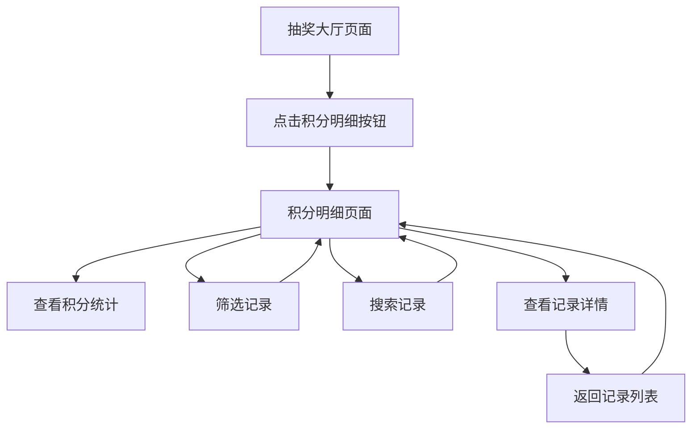

# 积分明细功能 - 产品需求文档

## 1. 产品概述

积分明细功能是小六成长记录小程序中的重要组成部分，为用户提供完整的积分获取和使用记录查看功能。通过直观的界面设计，帮助小学生用户了解自己的积分变化情况，培养良好的积分管理意识。

该功能主要解决用户对积分来源和去向不清楚的问题，让家长和孩子都能清晰地追踪积分的每一笔变化，增强积分系统的透明度和可信度。

## 2. 核心功能

### 2.1 用户角色

本功能不区分用户角色，所有用户都具有相同的积分明细查看权限。

### 2.2 功能模块

积分明细功能包含以下主要页面：

1. **抽奖大厅页面（改进）**：在积分显示区域添加积分明细入口按钮
2. **积分明细页面**：显示完整的积分获取和使用记录列表
3. **积分记录详情**：展示单条积分记录的详细信息

### 2.3 页面详情

| 页面名称   | 模块名称   | 功能描述                                     |
| ------ | ------ | ---------------------------------------- |
| 抽奖大厅页面 | 积分显示区域 | 在现有积分数值旁边添加"明细"按钮，点击跳转到积分明细页面            |
| 积分明细页面 | 页面头部   | 显示当前总积分、本月获得积分、本月使用积分的统计信息               |
| 积分明细页面 | 筛选工具栏  | 提供按时间范围筛选（今天、本周、本月、全部）和按类型筛选（获取、使用、全部）功能 |
| 积分明细页面 | 搜索功能   | 支持按来源/用途关键词搜索积分记录                        |
| 积分明细页面 | 记录列表   | 按时间倒序显示积分记录，包含时间、类型图标、数量、来源/用途、余额信息      |
| 积分明细页面 | 空状态提示  | 当没有积分记录时显示友好的空状态提示                       |
| 积分记录详情 | 详情弹窗   | 点击记录项显示详细信息，包括具体时间、操作类型、积分变化、相关任务等       |

## 3. 核心流程

用户查看积分明细的主要操作流程：

1. 用户在抽奖大厅页面看到积分显示区域
2. 点击积分旁边的"明细"按钮
3. 进入积分明细页面，查看积分统计概览
4. 可选择使用筛选和搜索功能查找特定记录
5. 点击具体记录查看详细信息
6. 返回抽奖大厅或其他页面



## 4. 用户界面设计

### 4.1 设计风格

* **主色调**：橙色系（#FF6B35为主色，#FFE5D9为浅色背景）

* **按钮样式**：圆角矩形按钮，适合儿童点击的大尺寸设计

* **字体**：清晰易读的字体，重要信息使用较大字号

* **布局风格**：卡片式布局，信息层次清晰

* **图标风格**：使用emoji和简洁的图标，增加趣味性

### 4.2 页面设计概览

| 页面名称   | 模块名称   | UI元素                             |
| ------ | ------ | -------------------------------- |
| 抽奖大厅页面 | 积分显示区域 | 在原有积分显示右侧添加橙色"明细"按钮，使用📊图标，圆角设计  |
| 积分明细页面 | 页面头部   | 橙色渐变背景，白色文字，显示总积分大数字和本月统计小卡片     |
| 积分明细页面 | 筛选工具栏  | 横向滚动的筛选标签，选中状态为橙色背景，未选中为白色背景     |
| 积分明细页面 | 搜索框    | 圆角搜索框，占位符文字"搜索积分记录"，右侧搜索图标       |
| 积分明细页面 | 记录列表   | 白色卡片背景，左侧类型图标（+/-），中间信息文字，右侧积分数值 |
| 积分明细页面 | 空状态    | 居中显示可爱插图和提示文字"还没有积分记录哦\~"        |

### 4.3 响应式设计

本功能主要面向微信小程序环境，采用移动端优先设计：

* 适配不同尺寸的手机屏幕

* 支持触摸操作，按钮和点击区域足够大

* 考虑小学生的使用习惯，界面元素间距适中

* 文字大小适合儿童阅读

## 5. 数据结构设计

### 5.1 积分记录数据模型

```javascript
// 积分记录对象
{
  id: "record_001",           // 记录唯一标识
  userId: "user_123",         // 用户ID
  type: "earn",               // 类型：earn(获取) | spend(使用)
  amount: 10,                 // 积分数量（正数）
  source: "完成任务",          // 来源/用途描述
  taskId: "task_456",         // 相关任务ID（可选）
  lotteryId: "lottery_789",   // 相关抽奖ID（可选）
  balance: 150,               // 操作后的积分余额
  timestamp: 1703123456789,   // 时间戳
  date: "2023-12-21",         // 日期字符串
  time: "14:30",              // 时间字符串
  description: "完成数学作业任务" // 详细描述
}
```

### 5.2 积分统计数据模型

```javascript
// 积分统计对象
{
  totalPoints: 150,           // 当前总积分
  monthlyEarned: 80,          // 本月获得积分
  monthlySpent: 30,           // 本月使用积分
  todayEarned: 10,            // 今日获得积分
  todaySpent: 5,              // 今日使用积分
  weeklyEarned: 25,           // 本周获得积分
  weeklySpent: 15             // 本周使用积分
}
```

